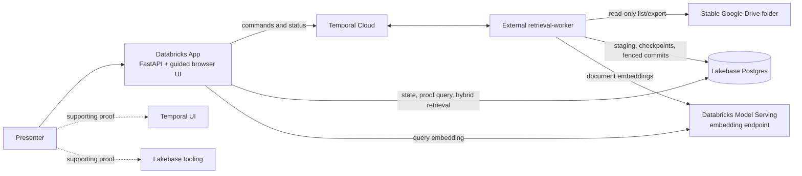

# Implementation specification: Google Drive retrieval with Temporal and Lakebase

Status: implemented locally; target-workspace feasibility and deployment rehearsal pending
Audience: engineers implementing and rehearsing the Databricks employee demo
Target duration: 10 minutes
Source foundation: `google-drive-integration` working tree

## Executive summary

Build a presenter-led Databricks App that demonstrates a real Google Drive folder being ingested,
searched, and safely deactivated through Temporal and Lakebase.

The audience should leave with one message:

> Temporal handles unreliable, long-running coordination. Lakebase makes transactional retrieval
> state authoritative. Together, they remove failure-recovery and consistency machinery that an
> application developer would otherwise have to build.

The live proof is a late-write race. One Drive document is fetched and paused immediately before
its database transaction. The presenter deactivates the retrieval store while that write is in
flight. Lakebase advances the store generation and makes all old content unsearchable immediately;
Temporal continues cancellation and cleanup. When the paused write is released, Lakebase rejects
it as stale and the document never reappears in retrieval.

The demo also uses Lakebase hybrid search to retrieve current Drive evidence through semantic and
keyword ranking. Google Drive is a real, read-only source, but the folder is stable during the live
presentation. The connector must still support later edits, additions, moves, and deletions without
requiring source changes or a new hardcoded manifest.

## Goals

1. Tell a coherent developer story rather than expose an operator dashboard.
2. Use a real, pre-seeded Google Drive folder as the end-to-end source.
3. Show Temporal absorbing a deterministic provider throttle and coordinating durable sync work.
4. Show Lakebase hybrid retrieval with source-linked evidence.
5. Prove that retrieval visibility becomes safe at the deactivation transaction, before physical
   cleanup completes.
6. Prove that a late generation-7 write cannot cross the generation-8 fence.
7. Use Temporal UI and Lakebase tooling as supporting proof without losing the App's narrative.
8. Let the folder contents evolve after the first implementation: modified and newly added
   supported files must be discovered on later syncs.
9. Make every run resettable and deterministic enough for repeated ten-minute rehearsals.

## Non-goals

- End-user Google OAuth or a multi-tenant connector authorization flow.
- Mirroring Google Drive ACLs into retrieval authorization.
- Writing, moving, renaming, or deleting Google Drive files.
- Parsing Office binaries, images, scanned/image-only PDFs, audio, or video.
- Demonstrating a real Google quota incident. The live throttle is explicitly demo-injected.
- Building a general-purpose RAG chatbot or adding a separate answer-generation model.
- Supporting concurrent presenters or concurrent demo runs in one environment.
- Moving the Temporal worker into the Databricks App process.
- Using Unity Catalog synced tables or a Databricks SQL warehouse. This is an operational
  Lakebase workload, not a lakehouse analytics workload.

## Audience and narrative

The audience is Databricks employees with mixed familiarity with Temporal. Avoid assuming that
they know workflow history, Activity cancellation, generation fencing, or retrieval-index cleanup.

The demo should introduce only three mental models:

- **Google Drive changes independently.** Files can be fetched or changed while lifecycle commands
  are in progress.
- **Temporal makes work durable over time.** It owns retries, quota waiting, fan-out, cancellation,
  and completion.
- **Lakebase decides what is true now.** It owns lifecycle state, generation checks, transactional
  search visibility, hybrid indexes, and the final commit boundary.

The App must explain outcomes in developer language. Prefer “Temporal resumed the sync after the
provider throttle” over workflow type names, and “Lakebase made generation 7 unsearchable” over
raw state transitions. Workflow IDs and SQL remain available as expandable proof.

## Ten-minute presenter flow

| Time | Presenter action | Audience sees | Point being proved |
|---|---|---|---|
| 0:00–1:00 | Open the App and review preflight | Drive, Temporal, Lakebase Search, embedding endpoint, and worker all ready | The demo is real and connected |
| 1:00–2:00 | Open the stable Drive folder, then start a fresh run | Curated Northstar files and source links | The content comes from a recognizable external source |
| 2:00–3:30 | Start sync | One labeled demo throttle, then resumed ingestion and one document held pre-commit | Temporal handles waiting and long-running coordination |
| 3:30–4:30 | Open Temporal UI from the current sync | Root workflow, child fan-out, durable quota wait, and in-flight document | The orchestration is not a UI simulation |
| 4:30–6:00 | Return to the App and ask the default question | Hybrid-ranked evidence with keyword/semantic contribution and Drive citations | Lakebase serves useful, current retrieval results |
| 6:00–7:30 | Deactivate the store while the document remains held | Generation advances from 7 to 8; retrieval becomes unavailable immediately; cleanup continues | Correctness does not wait for distributed cleanup |
| 7:30–8:30 | Open Lakebase tooling with the prepared proof query | Physical rows remain while retrieval-visible rows are zero | Lakebase is the transactional authority |
| 8:30–9:30 | Return and release the held write | `stale_generation_rejected`, then inactive generation 8 with zero owned rows | Late work cannot resurrect deactivated content |
| 9:30–10:00 | Open the recap | “What the developer wrote” vs. “What Temporal and Lakebase handled” | The two products make the developer's life easier |

Presenter pacing must remain manual. The App may highlight the recommended next action, but it
must not auto-advance lifecycle-changing steps.

## Product experience

### Overall layout

Replace the current four-equal-panel control room with one guided workspace:

1. A compact header containing the source name, current run, elapsed time, and readiness state.
2. A vertical or horizontal six-step story rail:
   **Connect → Sync → Retrieve → Deactivate → Reject late write → Recap**.
3. One primary stage showing the current action and outcome.
4. A secondary “Technical proof” drawer that changes with the active step.
5. Persistent links for **Open Drive**, **Open in Temporal**, and **Open Lakebase tooling** when
   their targets are available.

The active step must answer, in order:

- What is happening?
- Why should a developer care?
- Which product owns this responsibility?
- What did the developer not have to build?

### Preflight

The landing state performs no lifecycle mutation. It shows these checks:

| Check | Pass condition | Failure behavior |
|---|---|---|
| Google Drive | Dedicated service account can list the configured root folder; held file is present and supported | Block “Start demo”; show a credential, folder, or held-file-specific message |
| Temporal | Namespace reachable; retrieval and provider Task Queues have compatible pollers | Block “Start demo”; link to operator instructions |
| Lakebase | Database reachable; core, demo, connector, and search migrations ready | Block “Start demo”; show missing migration names only |
| Lakebase Search | Required extensions and index strategy verified | Block “Start demo”; never silently fall back to legacy text search |
| Embeddings | Configured endpoint reachable by both App and worker identities; expected vector dimension returned | Block “Start demo”; show endpoint name without credentials |
| Tool links | Temporal and Lakebase tooling URLs valid | Warn but do not block; offer copyable IDs/query instead |

Drive preflight must execute through a short Temporal workflow or equivalent provider-queue probe,
because Google credentials belong only to the worker. The App must not receive or proxy the Google
service-account credential.

### Source step

Show a bounded, sanitized folder snapshot read from Lakebase connector state:

- file title;
- supported/unsupported status;
- Google content type;
- Drive source link;
- current source version;
- the configured “late write” marker on exactly one file.

Additional supported files are ordinary content, not errors. Unsupported files appear only in a
collapsed summary. The App must not assume exactly five files, although the rehearsed baseline
folder should contain the five Northstar documents.

### Sync step

“Start sync” creates one operation and disables duplicate start actions until it reaches a safe
terminal state. Show a short event narrative instead of raw event names:

1. Drive scan started.
2. Demo-injected provider throttle observed.
3. Temporal waiting durably for five seconds.
4. Drive scan resumed.
5. `N - 1` supported documents committed to generation 7.
6. Configured late document fetched and held before commit.

The UI must label the quota event **Demo-injected Drive throttle**. Actual Drive `403`/`429`
handling remains implemented, but the presentation must not imply Google spontaneously throttled
the demo.

### Temporal proof

Provide a deep link to the current root sync workflow. The App keeps polling while the presenter is
in another tab and restores the active story step on return.

The technical drawer shows one short, expandable snippet based on the real implementation:

```python
permit = await self.request_quota_permit(request)
page = await workflow.execute_activity("provider_fetch_resource_page", ...)
```

The snippet must be snapshot-tested or generated from a versioned documentation constant so it
cannot silently drift from the implementation. It is explanatory, not a full code browser.

### Retrieval step

Use this editable default question:

> What should the account team prioritize before Northstar's renewal?

The response is an evidence brief, not a model-generated free-form answer. It contains:

- up to four unique Drive documents;
- a highlighted extractive passage from each;
- title and Drive source link;
- keyword rank, vector rank, and combined hybrid rank when available;
- the lifecycle generation at which evidence was read;
- a plain label: **Lakebase hybrid search**.

The evidence brief must be derived dynamically from current hits. It must not filter by packaged
fixture filenames or return hardcoded Northstar prose. If the user later edits or adds files, a new
sync and query can change the evidence without a code change.

### Deactivation and visibility proof

“Deactivate source” starts deactivation only after the held event has been observed. On the
generation-8 fence commit, the App immediately transitions to a safe state:

- retrieval controls are disabled;
- repeating the query returns a lifecycle explanation rather than stale or empty-looking success;
- visible retrieval rows are zero;
- physical document/chunk rows may remain while Temporal cleanup runs.

Show this proof card:

```text
Store state                  deactivating
Authoritative generation    8
Physical documents          > 0
Retrieval-visible documents 0
```

Provide a **Copy proof query** action and a configurable **Open Lakebase tooling** link. The query
must be read-only, scoped to the current store, and contain no credentials or raw document bodies.

The Lakebase technical drawer shows the essential guard:

```sql
WHERE stores.lifecycle_state IN ('active', 'syncing')
  AND documents.lifecycle_generation = stores.lifecycle_generation
  AND document_chunks.lifecycle_generation = stores.lifecycle_generation
```

### Late-write rejection

Enable “Release late write” only after generation 8 is authoritative and the held event exists.
Releasing it lets the already-fetched generation-7 Activity attempt its transaction. Show these
outcomes in sequence:

1. Late writer released.
2. Lakebase compared expected generation 7 with actual generation 8.
3. Transaction rejected as stale.
4. Temporal cleanup completed.
5. Store inactive at generation 8 with zero owned documents and chunks.

The success criterion is the Lakebase result, not cancellation. Cancellation limits wasted work;
the generation guard guarantees safety.

### Recap

The final screen contains two compact columns:

| Developer supplied | Platform handled |
|---|---|
| Drive adapter and document transformation | Temporal retries, timers, fan-out, idempotency, cancellation, and recovery |
| Business lifecycle commands | Lakebase transactions, current-generation visibility, hybrid search, and stale-write rejection |
| One query and one deactivation action | Durable convergence across Drive, worker restarts, and asynchronous cleanup |

End with the agreed message, not implementation statistics.

## Architecture



Runtime boundaries remain strict:

- The Databricks App serves HTTP, submits commands, reads Lakebase, and queries embeddings.
- The worker executes all Workflows and Activities and holds Google credentials.
- Temporal stores coordination state and never stores document bodies or embeddings in Workflow
  Event History.
- Lakebase stores authoritative lifecycle state, retrieval content, hybrid indexes, durable
  connector staging, and presentation events.

## Google Drive connector requirements

### Authentication and scope

- Use a dedicated service account.
- Grant only `https://www.googleapis.com/auth/drive.readonly`.
- Share only the stable demo folder with that identity unless the folder is in a Shared Drive where
  explicit membership is required.
- Inject credentials through the external worker platform's secret mechanism.
- Never include credentials in the Databricks App configuration, Lakebase rows, Temporal inputs,
  logs, metrics, or demo events.

### Discovery and change behavior

The configured root folder is stable during a live run, but the connector supports later changes:

- recursively discover every supported child file;
- use Drive file ID as the stable source identity;
- use Drive version, checksum, modified time, or content hash as the source version;
- update changed content on a later sync;
- ingest newly added supported files on a later sync;
- emit durable tombstones for removed, trashed, moved-out, or newly unsupported files;
- preserve source title and `webViewLink` for citations;
- skip unsupported content with an observable reason rather than failing the entire folder;
- fail closed on incomplete searches or corrupt connector checkpoints.

The held document is configured by stable Drive file ID, not by filename:

```text
GOOGLE_DRIVE_HELD_FILE_ID=<stable-file-id>
```

Preflight verifies that this file remains inside the configured folder and is a supported type. A
presenter may modify its content without changing configuration. Replacing it with a new Drive
file requires updating the configured ID.

### Supported content

Retain the branch's initial support:

- Google Docs → plain text;
- Google Slides → plain text;
- Google Sheets → first-sheet CSV;
- uploaded PDFs with embedded text → page-labelled plain text;
- uploaded UTF-8 `text/*` and allowlisted text application types → original bytes.

Keep the existing maximum-size guard for both downloaded and extracted content. PDF OCR,
password-protected PDFs, and unsupported binaries are out of scope for this demo. Configure a
50 MiB bound for the 37 MB FlightFactor held manual so larger files in the folder remain skipped.

### Deterministic quota wrapper

Compose, rather than replace, the real Drive provider with a demo-only wrapper that injects one
`ProviderQuotaExhausted` result per run before the first provider page succeeds. Store consumption
state durably in `retrieval_demo_ui` so Activity retries cannot inject it twice.

Real Drive authentication, `403`/`429`, and `5xx` mappings remain active underneath the wrapper.

## Durable staging and connector state

Replace the branch's shared-filesystem requirement with Lakebase-backed staging for this demo. A
local filesystem cannot be authoritative because worker pods can restart or run concurrently.

Add a worker-owned schema such as `retrieval_connector` with these logical objects:

| Object | Purpose |
|---|---|
| `staged_objects` | Immutable content-addressed UTF-8 bodies keyed by SHA-256, with size and retention metadata |
| `scan_runs` | Store, generation, sync sequence, root folder, status, and timestamps |
| `scan_pages` | Idempotent compact page results and next-cursor identities |
| `scan_files` | Sanitized observed file metadata and source versions for one scan |
| `scan_cursors` | Traversal state referenced by opaque workflow cursors |
| `source_baselines` | Last complete set of Drive file IDs per store/root scope |
| `source_tombstones` | Durable deletions emitted until safely reconciled |

Requirements:

- Staged bodies remain outside Temporal history.
- A staging URI uses an opaque content-addressed scheme such as
  `lakebase-stage://sha256/<digest>`.
- Reading a staged object revalidates its SHA-256 digest.
- The worker role can read/write connector state; the App role cannot read raw staged bodies.
- The App reads sanitized source metadata through an explicitly granted view or demo projection.
- Page and cursor writes are idempotent and transactionally committed before a manifest returns.
- Retention is configurable, defaults to seven days in the demo environment, and never removes an
  object that an open workflow may retry.
- Cleanup is bounded and observable.

## Lakebase hybrid search

### Feasibility gate

Lakebase Search is Beta and its installed API is authoritative. Before implementation changes the
schema, run a target-workspace spike that proves:

1. `lakebase_vector` and `lakebase_text` are available and can be installed in the dedicated
   project/database.
2. The worker and App roles have the required schema and index privileges.
3. The chosen embedding endpoint dimension and Lakebase vector column match.
4. Newly inserted and updated chunks become queryable by both search legs under the target
   extension versions.
5. Index behavior after scale-to-zero meets the rehearsal timing target.

If the target `lakebase_text` version requires a corpus/index refresh after mutations, implement an
explicit bounded refresh step at the end of sync. The App remains in **Indexing** until it succeeds.
Do not silently route to the existing `postgres_text` backend.

### Schema and ingestion

Extend the retrieval chunk schema with the embedding and keyword representation required by the
installed extensions. Embeddings are generated in a worker Activity after deterministic chunking
and before the fenced Lakebase transaction.

The document, all chunks, their embeddings, search representations, and the idempotency receipt
must commit atomically after the generation check. A retry with the same canonical payload returns
the stored result; a different payload with the same key remains a conflict.

### Query behavior

The App generates one query embedding through the declared Model Serving endpoint, then runs two
bounded current-generation searches:

1. vector candidates for semantic similarity;
2. BM25 candidates for exact and domain-specific terms.

Combine the top candidates with reciprocal rank fusion. Return ranks and the combined score so the
UI can explain why an item matched. Candidate lists and final results are bounded; raw row dumps
are prohibited.

Every search leg applies the readable-lifecycle and current-generation predicate. A deactivating
or inactive store returns a lifecycle conflict before producing evidence.

## Demo service and API changes

Generalize the Northstar service so provider metadata, source roles, and retrieval results are not
hardcoded to fixture filenames.

### Run configuration

Persist this resolved configuration with every run:

- source provider: `google-drive`;
- root folder ID or irreversible display-safe hash;
- held Drive file ID mapped to `gdrive:<file-id>`;
- default question;
- baseline generation 7;
- embedding model identity and dimension;
- hybrid backend version;
- source snapshot/file count observed by preflight.

### Endpoints

Retain existing idempotency behavior and add or extend these endpoints:

| Method and path | Purpose |
|---|---|
| `POST /api/demo/preflight` | Start an asynchronous provider/platform readiness probe |
| `GET /api/demo/preflight/{operation_id}` | Poll readiness and sanitized folder metadata |
| `POST /api/demo/runs` | Create a fresh generation-7 store from the current preflight snapshot |
| `GET /api/demo/runs/{run_id}/snapshot` | Return story step, lifecycle, counts, controls, links, and proof counts |
| `GET /api/demo/runs/{run_id}/source-files` | Return bounded sanitized Drive metadata from Lakebase |
| `POST /api/demo/runs/{run_id}/sync` | Start the real Drive sync with Drive quota metadata |
| `POST /api/demo/runs/{run_id}/ask` | Run query embedding plus hybrid retrieval and return an evidence brief |
| `POST /api/demo/runs/{run_id}/deactivate` | Fence, cancel, drain, and clean the store |
| `POST /api/demo/runs/{run_id}/controls/release` | Release the configured held Drive writer after the fence |
| `GET /api/demo/runs/{run_id}/proof` | Return physical/visible counts and the prepared read-only proof query |
| `GET /api/demo/runs/{run_id}/events` | Return the bounded presentation timeline |
| `GET /api/operations/{operation_id:path}` | Poll any asynchronous command |

Every POST requires `Idempotency-Key`. Long-running work returns an accepted operation and is
polled; no request may rely on remaining open near the Databricks Apps proxy timeout.

### Snapshot state machine

Expose one explicit story state rather than making the browser infer it from unrelated fields:

```text
preflight
ready
syncing
held
retrievable
deactivating
fenced
late_write_rejected
complete
failed
```

The server derives story state from authoritative Lakebase controls/events plus best-effort
Temporal status. A temporary Temporal query failure must not erase Lakebase state.

## External tooling links

### Temporal UI

Continue using `TEMPORAL_WEB_BASE_URL`, supporting a base URL or template. Generate links only for
credential-free HTTP(S) locations and include namespace and workflow ID safely.

The App should link to:

- current root sync workflow during ingestion;
- quota workflow while waiting;
- deactivation workflow after the fence.

### Lakebase tooling

Configure a credential-free workspace/project tooling URL separately from the SQL text. Because
deep-link formats can change, the App must always offer **Copy proof query** even when a tooling URL
is absent.

The proof query returns only:

- lifecycle state;
- current generation;
- physical document/chunk counts;
- retrieval-visible document/chunk counts.

It must be parameterized or generated with a safely quoted current store key and must never select
body, chunk text, embedding, credential, or idempotency-key values.

## Deployment and permissions

Retain the current split:

- Databricks App: FastAPI and static UI;
- external long-running worker: Temporal workflows, Activities, Drive client, and embeddings;
- shared Lakebase database;
- Temporal Cloud namespace.

### Databricks App resources

Declare in both `apps/retrieval_demo/databricks.yml` and the effective `app.yaml`:

- Lakebase database with `CAN_CONNECT_AND_CREATE` and the existing reviewed SQL grants;
- embedding Model Serving endpoint with `CAN_QUERY`;
- Temporal address, namespace, and API-key secrets with `READ`;
- any configurable tooling URL as a non-secret environment value.

Do not hardcode workspace IDs or endpoint names in source. Deployment must validate and then start
the App; bundle upload alone is not sufficient.

### Worker resources

The external worker identity requires:

- existing Lakebase worker grants plus connector staging/search privileges;
- `CAN_QUERY` on the embedding endpoint;
- Google service-account credential secret access;
- outbound TLS to Google APIs, Temporal Cloud, Databricks control plane/Model Serving, and Lakebase;
- both Temporal Task Queues and at least 60 seconds graceful termination.

The App and worker continue using distinct database identities. The App receives no raw staging
body privilege and no Google credential.

## Configuration contract

Add or replace these settings, with secrets delivered through platform bindings rather than
committed files:

| Variable | Owner | Meaning |
|---|---|---|
| `GOOGLE_DRIVE_ROOT_FOLDER_ID` | Worker | Stable folder subtree |
| `GOOGLE_DRIVE_HELD_FILE_ID` | Worker | Stable late-write file identity, projected to the App through sanitized preflight state |
| `GOOGLE_DRIVE_CREDENTIAL_KEY` | Worker | Opaque quota-scope identity |
| `GOOGLE_DRIVE_USER_KEY` | Worker | Stable opaque provider user |
| `GOOGLE_DRIVE_CREDENTIALS_FILE` or approved workload identity config | Worker | Service-account authentication |
| `GOOGLE_DRIVE_MAX_FILE_BYTES` | Worker | Bounded download/export size |
| `GOOGLE_DRIVE_REQUEST_TIMEOUT` | Worker | Per-request timeout |
| `RETRIEVAL_STAGING_BACKEND` | Worker | Must be `lakebase` in deployed demo |
| `RETRIEVAL_STAGING_RETENTION_HOURS` | Worker | Default 168 hours |
| `RETRIEVAL_EMBEDDING_ENDPOINT` | App and worker | Injected endpoint name |
| `RETRIEVAL_EMBEDDING_DIMENSION` | App and worker | Validated schema/model dimension |
| `RETRIEVAL_SEARCH_BACKEND` | App and worker | Must identify Lakebase hybrid search |
| `RETRIEVAL_DEMO_DEFAULT_QUESTION` | App | Editable seeded question |
| `TEMPORAL_WEB_BASE_URL` | App | Temporal UI base/template |
| `LAKEBASE_TOOLING_BASE_URL` | App | Optional tooling landing/deep link |

Remove the deployed requirement for `GOOGLE_DRIVE_STAGING_DIRECTORY`. It may remain available only
for explicitly local connector unit tests.

## Migration from `codex/google-drive-integration`

### Reuse

- `GoogleDriveApiClient`, token refresh, read-only scope, and error mapping;
- Drive response models;
- recursive folder traversal and supported MIME decisions;
- stable `gdrive:<file-id>` document identity;
- source-version and source-link behavior;
- compact provider contract and tombstone semantics;
- focused unit-test fixtures.

### Refactor

- replace filesystem staging and checkpoint state with Lakebase repositories;
- separate Drive transport, traversal, and durable state behind protocols;
- compose the Google provider with the demo quota wrapper, pre-commit hold, and event sink;
- close the Drive API client through the adapter bundle lifecycle;
- derive sync metadata from `GoogleDriveConfig.sync_metadata()` rather than hardcoded Northstar
  metadata;
- generalize demo controls from fixture filename to Drive document key;
- replace filename-filtered answers with dynamic hybrid evidence;
- add deployment secrets, egress, embedding endpoint, and connector/search grants.

### Do not carry forward

- local/shared filesystem as deployed authoritative state;
- `northstar-scripted` provider labels for Drive runs;
- fixture filename equality in answer generation;
- a UI that gives account, topology, answer, and failure panels equal narrative weight;
- a silent fallback to `postgres_text` when Lakebase Search is unavailable.

## Implementation sequence

### Phase 0: target feasibility

1. Verify Lakebase Search extensions and mutation/index behavior.
2. Verify App and worker access to the selected embedding endpoint.
3. Verify the worker platform can inject Google credentials and reach Google APIs.
4. Record the stable folder ID and held file ID without committing them.
5. Run one read-only export smoke test against every rehearsed Google content type.

Exit criterion: all preflight dependencies are proven in the target environment.

### Phase 1: durable Drive connector

1. Add connector migrations and least-privilege grants.
2. Implement Lakebase staging and traversal/checkpoint repositories.
3. Refactor the Drive provider to use those repositories.
4. Add modification, addition, removal, retry, and worker-restart tests.

Exit criterion: a real stable-folder sync survives process restart without losing staged data or
cursor state.

### Phase 2: Lakebase hybrid retrieval

1. Add embedding/search schema migrations using target-verified extension APIs.
2. Add worker document-embedding Activity and atomic fenced commit.
3. Add App query embedding and bounded hybrid query.
4. Add explicit post-sync index refresh if required by the installed text extension.
5. Add lifecycle visibility and stale-generation search tests.

Exit criterion: current content is retrieved through both ranking legs and becomes unavailable in
the generation-advance transaction.

### Phase 3: demo composition

1. Generalize run configuration and source roles.
2. Compose real Drive, deterministic quota injection, hold hook, and event sink.
3. Add provider preflight workflow and asynchronous API.
4. Add proof counts/query and explicit story-state derivation.

Exit criterion: the complete headless Drive-backed scenario produces the required event sequence.

### Phase 4: guided App

1. Replace the four-panel layout with the story rail and primary stage.
2. Add Drive, Temporal, and Lakebase tooling handoffs.
3. Add dynamic evidence cards and expandable code snippets.
4. Preserve current run/story state across tab switches and refreshes.
5. Add responsive and accessible interaction states.

Exit criterion: a presenter unfamiliar with the code can complete the scripted run from on-screen
cues in ten minutes.

### Phase 5: deployment and rehearsal

1. Update App and worker resources, permissions, secrets, and egress.
2. Validate migrations and effective App/worker database grants.
3. Run full source verification and opt-in cloud integration tests.
4. Rehearse three fresh runs, including one App restart between steps and one worker restart during
   provider work.
5. Record rollback and demo-reset instructions.

Exit criterion: three consecutive rehearsals complete without manual database repair.

## Acceptance criteria

### Functional

- Preflight proves Drive, Temporal pollers, Lakebase migrations/Search, embeddings, and held-file
  configuration before enabling a run.
- A fresh run reads the configured Drive folder using read-only credentials.
- All supported files present at scan time are represented; additions are not rejected because the
  baseline has more than five files.
- One deterministic provider throttle occurs exactly once and produces a visible durable wait.
- All supported documents except the configured held document commit at generation 7.
- The held document has been downloaded, transformed, embedded, and staged before it waits.
- The default question returns current hybrid-ranked evidence with Drive citations and ranking
  contribution.
- Deactivation commits generation 8 before cancellation/drain/cleanup completes.
- Immediately after that commit, retrieval-visible document and chunk counts are zero even if
  physical counts are nonzero.
- Releasing the held generation-7 writer produces `stale_generation_rejected`.
- Final state is inactive generation 8 with zero owned documents and chunks.
- Temporal UI links resolve to the workflows used by the current run.
- The copied Lakebase proof query reproduces the App's safe-visibility counts.
- A later Drive content edit is detected and reindexed on the next fresh sync.
- A later supported-file addition is discovered and can appear in hybrid results without code or
  manifest changes.

### Reliability and performance

- Preflight normally completes within 30 seconds.
- The deterministic throttle lasts five seconds.
- The small-folder sync reaches “held and retrievable” within 60 seconds in the rehearsed target.
- A hybrid query normally returns within three seconds, including query embedding.
- Deactivation reaches the generation fence within five seconds and terminal cleanup within 30
  seconds for the baseline folder.
- Every command is idempotent across browser retries and App restarts.
- Worker restart after staging but before commit does not require refetching unavailable bytes and
  does not corrupt page reconciliation.
- No App request depends on remaining open near the 120-second proxy timeout.

### Security and privacy

- Google scope is read-only and limited to the dedicated demo identity.
- App and worker database identities remain distinct and least-privileged.
- Raw Drive bodies and embeddings never enter Temporal Workflow Event History.
- Google credentials, clear-text DSNs, raw idempotency keys, and document bodies never appear in
  logs, metrics, demo events, proof queries, or API responses.
- Source links are validated HTTP(S) links and open with `noreferrer`.
- Connector staging rows are inaccessible to the App role except through sanitized metadata
  projections.

### Verification

- Existing unit, contract, replay, App, demo, and load-harness tests continue to pass.
- Add focused tests for Google authentication/error mapping, traversal, dynamic additions,
  modifications, tombstones, staging integrity, and restart recovery.
- Add a Lakebase integration test for atomic embeddings/chunks/receipt commit and generation
  rejection.
- Add a hybrid-search integration test using the target extension versions.
- Add a Temporal integration test that uses the real Drive composition with a fake HTTP transport
  and proves the late-writer sequence.
- Add a protected opt-in smoke test against the stable Drive folder; never run it in default CI.
- Add browser smoke tests for the guided happy path, disabled unsafe actions, tab-return state, and
  lifecycle search rejection.
- Update deployment validation and smoke selectors whenever UI copy changes.

## Risks and mitigations

| Risk | Mitigation |
|---|---|
| Lakebase Search Beta API or mutation semantics differ by target version | Phase-0 spike; use installed documentation and explicit index refresh; no silent backend substitution |
| Google credentials or egress fail on the worker platform | Dedicated preflight workflow and target smoke test |
| Drive folder changes break hardcoded evidence | Dynamic discovery/evidence; only the held file uses configured stable ID |
| Embedding endpoint cold start slows the demo | Preflight warm-up query and bounded timeout |
| External-tab switching loses presenter context | Persist run/step locally and keep server state authoritative |
| A demo control is mistaken for real provider behavior | Label the injected throttle and held commit as demo controls |
| Connector staging grows indefinitely | Seven-day default retention, bounded cleanup, and open-workflow protection |
| Added files make sync exceed the ten-minute story | Show bounded counts, warn when folder exceeds rehearsed limits, and maintain a curated baseline folder |

## Definition of done

The feature is done when a presenter can open a single Databricks App, pass preflight, show a real
stable Google Drive folder, complete the scripted ten-minute flow across the App, Temporal UI, and
Lakebase tooling, and finish with an inactive generation-8 store containing no retrieval-owned
documents or chunks. Content-addressed connector staging may remain only for its bounded retention
window. The same source must also ingest a later supported-file edit or addition without changing
application code.

## Implementation references

- Existing system behavior: [Lakebase and Temporal demo specification](lakebase-temporal-demo-spec.md)
- Candidate connector: [Google Drive integration](google-drive-integration.md)
- Current source map: [Implementation map](../IMPLEMENTATION_MAP.md)
- Lakebase Search: <https://docs.databricks.com/aws/en/oltp/projects/lakebase-search>
- Google Drive export formats:
  <https://developers.google.com/workspace/drive/api/guides/ref-export-formats>
- Google Drive error behavior:
  <https://developers.google.com/workspace/drive/api/guides/handle-errors>
