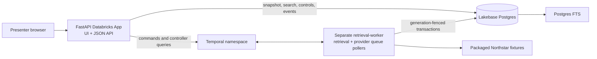

# Lakebase + Temporal Northstar demo: as-built reference

- Status: implemented and packaged; target deployment not performed
- Audience: new contributors, demo operators, Temporal and Databricks reviewers
- Scenario: `northstar-v1`
- Last updated: 2026-07-18

## Purpose

This repository demonstrates one clear division of responsibility:

> Temporal remembers what must happen across time and failure. Lakebase decides what is currently
> true at the mutation boundary and makes that truth retrievable.

Temporal owns workflow history, retries, bounded fan-out, shared provider quota waits,
cancellation, draining, and cleanup order. Lakebase owns store lifecycle state and generation,
documents, chunks, write receipts, demo controls, and the transaction that accepts or rejects a
late write. The design assumes Temporal Activities are at least once; it does not claim exactly-once
execution.

The deployable demo artifacts are present: database migrations, worker code and container, FastAPI
App, static UI, root App manifest, and Databricks bundle. No target Lakebase database, Databricks
App, or Temporal worker has been created or deployed from this repository. A future operator must
still validate identity, grants, networking, migrations, and readiness in the chosen environment.

## Northstar story

A new run creates a unique internal store such as `northstar-7f3a9c` while the UI displays
**Northstar AI**. The store starts `active` at lifecycle generation 7.

| Fixture | Account fact | Runtime behavior |
|---|---|---|
| `northstar-qbr.md` | EU residency and SCIM expansion requirements | Normal commit |
| `renewal-plan.md` | Renewal date is September 30 | Normal commit |
| `support-escalation.md` | P1 ingestion-latency target is August 15 | Normal commit |
| `stakeholders.md` | Aisha, VP Engineering, is the champion | Normal commit |
| `late-security-review.md` | Security review is a renewal dependency | Held after parse/chunk, before transaction |

The scripted provider atomically injects one quota-exhausted response on `list_active_users` with a
five-second retry. Temporal records the reset, waits durably, and retries without losing the
provider cursor. Four documents commit at generation 7. The fifth Activity loads, verifies,
parses, and chunks its body, then pauses in a bounded demo-only pre-commit gate.

The default question is:

> What should the account team prioritize before Northstar's renewal?

The deterministic evidence answer cites committed renewal, support, QBR, and stakeholder chunks.
No external model is required.

Deactivation atomically changes Lakebase from `active`/7 to `deactivating`/8 before Temporal asks
old work to cancel. When the held generation-7 writer is released, it reaches the normal repository
transaction and Lakebase rejects it as stale. Cleanup deletes documents in bounded batches and the
store becomes `inactive` at generation 8 only after users, retrieval state, documents, and chunks
are all empty.

## Visible proof in the App

The four-panel UI presents:

1. authoritative Lakebase lifecycle state, generation, user/document/chunk counts, and controls;
2. Temporal controller, sync, quota, ingestion, and deactivation workflow IDs, with optional
   Temporal Web links;
3. a durable event timeline containing the quota pause, held commit, `7 -> 8` fence,
   stale-generation rejection, cleanup batches, and final inactive state;
4. current-generation search results and a deterministic cited answer.

The App polls durable operation and snapshot APIs. If a Temporal status query is temporarily
unavailable, the combined snapshot still returns Lakebase state and a warning. Search and ask fail
closed after the store leaves a readable state.

## Architecture and ownership



| Concern | Owner |
|---|---|
| Command serialization and operation ownership | `StoreControllerWorkflow` |
| User/resource/page/document fan-out | Joined Temporal workflow tree |
| Provider permit/reset state | Shared `UserQuotaWorkflow` |
| Lifecycle state and monotonic generation | `retrieval.stores` |
| Acceptance/rejection of mutations | Lakebase transaction |
| Searchable metadata, text chunks, and receipts | `retrieval` schema |
| Northstar run controls, events, operations, and HTTP receipts | `retrieval_demo_ui` schema |
| Demo document bodies | Packaged, manifest-allowlisted fixture files |
| Presentation and asynchronous command submission | FastAPI App |

The worker and App are intentionally separate processes. A request-lifetime App process is not a
safe home for long-lived Temporal pollers.

The complete diagrams are in [`workflow-topology.md`](workflow-topology.md).

## Correctness invariants

1. A store generation is monotonic and never rewound.
2. Deactivation commits generation `N + 1` and `deactivating` before cancellation.
3. Normal writes require `active` or `syncing` and the exact current generation.
4. Cleanup requires `deactivating` and the exact current generation.
5. Lifecycle validation and mutation share one database transaction.
6. Document metadata, all chunks, and the write receipt commit or roll back together.
7. While its generation remains current and writable, same idempotency key plus the same canonical
   payload is a successful duplicate; different payload reuse is a conflict. After a fence,
   stale-generation rejection takes precedence over historical receipts.
8. Search joins the current store generation and readable lifecycle state, so stale rows cannot be
   returned even while cleanup is pending.
9. Workflow history contains `DocumentRef` metadata, not provider bodies or chunks.
10. Demo code remains unavailable unless `RETRIEVAL_DEMO_MODE=true`.
11. A fresh run gets a new run ID and store key; reset never decrements an old store.
12. Credentials, raw idempotency keys, document bodies, and clear-text DSNs are absent from demo
    events and application metric labels.

Cancellation reduces wasted work. It is not the safety boundary: the committed database generation
is authoritative.

## Lakebase core schema

Forward-only, checksum-verified core migrations live in
`src/retrieval/lakebase/migrations`. An advisory transaction lock serializes migration runners and
applied checksums are verified before status or apply succeeds.

| Table | Important contents |
|---|---|
| `retrieval.schema_migrations` | version, name, SHA-256 checksum, timestamp, actor |
| `retrieval.stores` | display name, lifecycle state, generation, transition/update timestamps |
| `retrieval.store_users` | active flag and generation by store/user |
| `retrieval.retrieval_state` | JSON state value and generation by store/key |
| `retrieval.documents` | source version/URI, body hash, metadata, and committed generation |
| `retrieval.document_chunks` | deterministic ordinal, text, hash, generation, generated `tsvector` |
| `retrieval.write_receipts` | operation, document, generation, payload hash, durable result |

The document/chunk foreign key cascades chunk deletion. Generation indexes support cleanup and
current-state reads. A GIN index supports the generated English full-text vector.

### Document commit transaction

For an upsert, `LakebaseRetrievalRepository`:

1. starts a transaction and locks the store row;
2. verifies expected generation and a writable lifecycle state;
3. inserts or matches the durable idempotency receipt while the generation is still writable;
4. upserts document metadata;
5. replaces that document's chunks;
6. commits all effects together.

Deletes follow the same fence and receipt boundary. Serializable/deadlock failures are retried up
to the configured transaction retry limit. A writer that reaches step 2 after a deactivation fence
is stale even if it was scheduled earlier or has a historical receipt.

### Bounded cleanup

`RemoveObjectsWorkflow` schedules `remove_object_batch_generation_fenced` repeatedly. Each Activity
locks and validates the store, deletes at most `OBJECT_CLEANUP_BATCH_SIZE` documents in stable key
order, counts cascaded chunks, clears retrieval state once no documents remain, and reports whether
another batch is needed. The workflow carries cumulative progress through Continue-As-New when
Temporal suggests rollover.

The code retains a versioned legacy branch for histories created before batching.
`artifacts/histories/remove-objects-pre-batch.json` exercises that branch in replay tests.

## Search and answers

`PostgresTextSearch` is the supported backend. It uses `websearch_to_tsquery`, `ts_rank_cd`, stable
document/chunk tie-breaking, bounded limits, and highlighted excerpts. Its SQL joins
`document_chunks`, `documents`, and `stores`, requiring:

- store state `active` or `syncing`;
- document generation equal to the store generation; and
- chunk generation equal to the store generation.

`RETRIEVAL_SEARCH_BACKEND=postgres_text` is the default. `lakebase_hybrid` is a named reservation
that fails explicitly because no hybrid index migration or adapter is bundled; it never silently
masquerades as text search.

The demo answerer orders retrieved Northstar evidence into a stable account brief and exposes each
citation as `document_key#chunk-N`. This keeps the required demo independent of an answer-model
network call.

## Demo schema and controls

Forward-only demo migrations live in `src/retrieval/demo/migrations`. The **migration role owns both
`retrieval` and `retrieval_demo_ui`**, including the seed function. The App does not own either
schema and this application never creates one at runtime. The managed Databricks resource may
still confer database-level `CREATE`, as described in the deployment section below.

| Object | Purpose |
|---|---|
| `demo_runs` | unique run/store mapping, baseline generation, presentation status |
| `demo_controls` | quota-once flag, five-second retry, held document, hold/release state, version |
| `demo_events` | deduplicated, bounded event timeline keyed by `(run_id, event_key)` |
| `demo_operations` | asynchronous sync/deactivation/control/ask operation records |
| `api_idempotency` | durable HTTP request/response receipts keyed by scope and key hash |
| `schema_migrations` | demo migration version and checksum ledger |
| `create_northstar_run(...)` | fixed-purpose, revoked-by-default `SECURITY DEFINER` seed function |

The seed function accepts only the known Northstar display name, generation 7, five-second quota,
held filename, `true` hold flag, and a constrained unique store-key format. It inserts the core
store plus run, controls, and initial event atomically and rejects conflicting reuse.

The App gets `EXECUTE` on this function, core `SELECT`, and explicit demo DML. It does not get core
`INSERT`, `UPDATE`, or `DELETE`. The worker gets core DML and only the demo control/event access its
scripted adapters need. Public schema/table/function access is revoked. Exact grants and their
application command are in the [migration runbook](runbooks/migration-and-rollback.md).

## Deterministic provider and late-writer gate

`ScriptedNorthstarProvider` exposes one user and one files page containing the five versioned
`DocumentRef` values. Its quota injection is an atomic update in `demo_controls`, so worker restarts
or Activity retries cannot inject an unbounded series of quota errors.

`FixtureStagingStore` accepts only `fixture://northstar/...` URIs present in the packaged scenario
manifest, rejects traversal/encoding tricks, and verifies the SHA-256 hash before returning bytes.

`DemoBeforeDocumentCommitHook` runs after body verification, parsing, and chunking but before the
repository transaction. It applies only to the configured late document. It emits a durable held
event, heartbeats while waiting, observes a Lakebase release control, and times out after at most 30
seconds. For the demo proof it absorbs Activity cancellation only inside this bounded wait, then
allows the normal stale-generation transaction to execute. This does not change global Activity
cancellation behavior.

## App API and process lifecycle

`apps.retrieval_demo.app` serves API and static assets from one FastAPI/Uvicorn process. Importing
the module reads no environment and opens no connections. The FastAPI lifespan builds the service,
opens Lakebase/Temporal resources, and closes resources even after partial startup failure.

| Method and path | Behavior |
|---|---|
| `GET /healthz` | Process liveness only |
| `GET /readyz` | Lakebase connectivity, both migration ledgers, and Temporal connectivity; 503 on failure |
| `POST /api/demo/runs` | Create/idempotently replay a fresh fixed Northstar run; 201 |
| `GET /api/demo/runs/{run_id}/snapshot` | Database snapshot plus best-effort controller status |
| `GET /api/demo/runs/{run_id}/events` | Timeline with `after_event_id` and bounded `limit` |
| `GET /api/demo/runs/{run_id}/search` | Current readable-generation search |
| `POST /api/demo/runs/{run_id}/sync` | Submit async controller sync; 202 |
| `POST /api/demo/runs/{run_id}/deactivate` | Submit async deactivation; 202 |
| `POST /api/demo/runs/{run_id}/controls/hold` | Enable the configured hold before commit |
| `POST /api/demo/runs/{run_id}/controls/release` | Release only after the generation fence |
| `POST /api/demo/runs/{run_id}/ask` | Return deterministic cited evidence for `{question}` |
| `GET /api/operations/{operation_id:path}` | Poll durable operation state |

Every `POST` requires `Idempotency-Key`. Same scope/key/request returns the stored response;
different request reuse returns a conflict. Run/store authorization is derived server-side; the
caller cannot supply an arbitrary store key.

`TEMPORAL_WEB_BASE_URL` optionally enables safely encoded workflow deep links. It may be a base
origin or a template containing `{namespace}` and `{workflow_id}`.

The supported App executable loads the exact working-directory `.env`, or the file selected by
`RETRIEVAL_ENV_FILE`, before reading its port and starting Uvicorn. Existing process values win and
interpolation is disabled. Importing the module still reads no environment. Databricks deployments
do not package local environment files; their resource, secret, and platform injection remains the
runtime source of configuration.

## Runtime configuration

The complete variable tables and factory precedence are maintained in
[`IMPLEMENTATION_MAP.md`](../IMPLEMENTATION_MAP.md#temporal-process-configuration). The essential
full-stack values are:

```text
PGHOST, PGPORT, PGDATABASE, PGUSER, PGSSLMODE
LAKEBASE_ENDPOINT                           # OAuth deployment
# or PGPASSWORD                             # SSL-enabled local Postgres, never both

TEMPORAL_ADDRESS, TEMPORAL_NAMESPACE, TEMPORAL_TLS
TEMPORAL_API_KEY                            # when required
RETRIEVAL_DEMO_MODE=true
RETRIEVAL_SEARCH_BACKEND=postgres_text
RETRIEVAL_ADAPTER_BUNDLE_FACTORY=retrieval.demo.scripted_provider:create_adapter_bundle
OBJECT_CLEANUP_BATCH_SIZE=250               # default
```

Databricks Apps injects canonical `PG*` values and the `LAKEBASE_ENDPOINT` resource path. The pool
uses a fresh Databricks OAuth database token for each new physical connection and rotates
connections before token lifetime is exhausted.

## Local execution and verification

No-service rehearsal:

```bash
uv sync --extra dev
uv run retrieval-demo-headless --json
```

Full local processes:

```bash
temporal server start-dev
uv run retrieval-lakebase-migrate
uv run retrieval-demo-migrate
uv run retrieval-lakebase-grant-roles \
  --app-role <APP_DB_ROLE> --worker-role <WORKER_DB_ROLE>

RETRIEVAL_ADAPTER_BUNDLE_FACTORY=retrieval.demo.scripted_provider:create_adapter_bundle \
  uv run retrieval-worker

uv run retrieval-demo-app
curl --fail http://127.0.0.1:8000/readyz
```

Run the migration and grant commands with the migration owner. Run the worker and App with their
own role credentials. The grant command is idempotent and quotes resolved role identifiers; it does
not provision roles.

Test layers:

- unit and repository-port contract tests cover parsing, lifecycle fencing, idempotency, bounded
  cleanup, configuration, demo state, and service behavior;
- Lakebase tests validate emitted SQL, transaction/pool behavior, migrations, and FTS contracts
  using test doubles;
- App tests exercise endpoint idempotency, errors, readiness, snapshots, and the real in-memory
  service through ASGI;
- the headless story proves the deterministic quota/fence/stale-writer/cleanup data-plane path;
- opt-in Temporal integration tests execute the general workflow tree against ephemeral servers;
- an opt-in Temporal late-writer test runs the real `DocumentIngestionWorkflow`/Activity, cancels
  the held work after the fence, and observes its stale commit attempt;
- replay tests include root sync and the pre-batch object-cleanup history;
- the opt-in load harness measures Temporal history/latency/fairness mechanics.

These checks do not establish live Lakebase connectivity, target grants, Databricks App startup, or
target Temporal compatibility. Those remain target-environment validation steps.

## Deployable artifacts and validation boundary

| Artifact | Location | Local validation |
|---|---|---|
| App source/process manifest | repository root plus `apps/retrieval_demo` | import/ASGI tests, compile, package build |
| Databricks bundle | `apps/retrieval_demo/databricks.yml` | `databricks bundle validate` with explicit profile/variables |
| Worker image | `Dockerfile.worker` | local Docker build and worker tests |
| Core schema | `src/retrieval/lakebase/migrations` | discovery/checksum/SQL tests; migration CLI |
| Demo schema and grants | `src/retrieval/demo/migrations` | discovery/SQL/grant-rendering tests; CLIs |
| Static UI | `apps/retrieval_demo/static` | App/browser rehearsal |

Validate the DAB from its own directory and never rely on an implicit Databricks profile:

```bash
cd apps/retrieval_demo
databricks bundle validate --strict --profile <PROFILE> -t dev \
  --var lakebase_branch=projects/<PROJECT>/branches/<BRANCH> \
  --var lakebase_database=projects/<PROJECT>/branches/<BRANCH>/databases/<DATABASE> \
  --var temporal_secret_scope=<SECRET_SCOPE>
```

The bundle binds resource alias `postgres` with `CAN_CONNECT_AND_CREATE`, injects
`LAKEBASE_ENDPOINT`, and maps Temporal address/namespace/API key from secrets. Bundle validation is
read-only with respect to application deployment. The worker is deployed separately and is not a
bundle App process. The bundle sync path promotes the repository root so the effective root
`app.yaml`, pinned requirements, `apps`, and `src/retrieval` are deployed as one source tree;
ignored `.env` files are not included.

`CAN_CONNECT_AND_CREATE` is a managed database-level grant: the App service principal receives
PostgreSQL `CONNECT` and `CREATE` on the selected database. Explicit runtime grants still constrain
existing core/demo objects, but do not revoke database `CREATE`. The selected database must
therefore be dedicated to this App/demo boundary. If local policy requires a no-DDL runtime,
revoke database `CREATE` after binding and repeat the effective-privilege test after every binding
change; the application itself does not create schemas at runtime.

## Least-privilege rollout order

For a future target environment:

1. provision/select a dedicated Lakebase branch and database, accounting for the App resource's
   managed database `CREATE` privilege;
2. identify the migration owner, App database role, and worker database role;
3. apply core migrations as the migration owner;
4. apply demo migrations as the same migration owner;
5. apply explicit App/worker grants with `retrieval-lakebase-grant-roles`;
6. check both migration ledgers and effective database/object privileges using each runtime
   identity, including the App's post-binding database `CREATE` result;
7. start at least one rehearsal worker and confirm both Task Queue pollers;
8. start the App, verify `/healthz` and `/readyz`, and run a fresh Northstar rehearsal;
9. only then consider admitting demonstration traffic.

For a production launch rather than a controlled demo, complete the additional HA, real-provider,
telemetry, security, representative replay, capacity, backup, and incident-response gates in
[`architecture-production-readiness.md`](architecture-production-readiness.md).

## Presenter sequence

1. Create a fresh run and show `active`, generation 7, zero documents.
2. Click **Sync account**; point out the quota event and durable wait/resume.
3. Show four committed documents and the held security-review document.
4. Ask the default question and inspect the four citations.
5. Click **Deactivate workspace** and stop on the database event `7 -> 8`.
6. Click **Release late write** only after the fence.
7. Show expected generation 7 versus actual generation 8 in
   `stale_generation_rejected`.
8. Show bounded cleanup events and final `inactive`, generation 8, zero documents/chunks.

If the run is contaminated, create another run. Never rewrite its generation. If Temporal Web is
unavailable, workflow IDs and database events remain visible. Native `postgres_text` is the only
bundled search backend and needs no external answer model.
