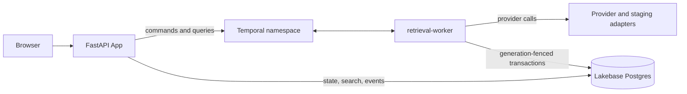

# System specification: durable retrieval with Temporal and Lakebase

This document defines the behavior of the system and its packaged Northstar demonstration. It is
written for readers who have not seen the code. For setup commands, start with the root
[README](../README.md). For diagrams, use [workflow topology](workflow-topology.md).

## The problem being solved

A retrieval service must copy data from an external provider into a searchable database. Real
syncs are not single requests: they paginate through users and resources, wait for provider quota,
retry failed calls, and may still be writing when an operator deactivates the data set.

Two failure modes shape this design:

1. Temporal Activities are at least once, so the same database mutation may be attempted more than
   once.
2. Cancellation is cooperative, so an Activity that was scheduled before deactivation can finish
   after deactivation starts.

The system therefore separates coordination from authoritative data safety:

> Temporal remembers what must happen across time and failure. Lakebase decides whether a mutation
> is still valid and stores the searchable truth.

## Components

| Component | Responsibility |
|---|---|
| Browser | Presents the demo and polls asynchronous operations |
| FastAPI App | Validates HTTP requests, submits Temporal commands, reads Lakebase state/search |
| Temporal namespace | Stores Workflow Event History, timers, retries, Signals, and operation state |
| `retrieval-worker` | Executes workflows and Activities from two Task Queues |
| Lakebase Postgres | Stores lifecycle, generations, documents, chunks, receipts, controls, and events |
| Provider/staging adapters | List provider objects and load document bodies outside workflow history |

The App and worker are separate processes. The App may scale or restart as an HTTP service. The
worker must remain on long-running compute and poll Temporal independently.



## Core concepts

### Store

A **store** is one independently synchronized retrieval data set. It has a display name, lifecycle
state, and current generation.

### Generation

A **generation** is a monotonically increasing integer. Every mutating command carries the
generation it expects. Lakebase compares that value with the store row inside the same transaction
as the mutation.

### Controller

Each store has one `StoreControllerWorkflow`. Applications send commands to this workflow through
`RetrievalClient` using Temporal Update-with-Start. The controller serializes commands, assigns
stable operation identities, and owns detached sync/deactivation work.

### Joined and detached workflows

A joined child must finish before its parent finishes. A detached operation receives a stable ID,
is acknowledged by Temporal, and may outlive the controller run that started it. Detached work
reports durable status back to the controller.

## Store lifecycle

The normal path is:

```text
active or syncing
        |
        | begin deactivation: commit generation N -> N + 1
        v
deactivating
        |
        | cancel, drain, clean users, clean objects
        v
inactive
```

If post-fence cleanup fails, the store remains at the new generation in a resumable failed state.
The generation is never decremented.

Deactivation order is fixed:

1. lock the store and commit `N → N + 1` with state `deactivating`;
2. acknowledge the fence to the controller;
3. request cancellation of generation-`N` sync/remediation work;
4. invalidate old quota requests and wait for owned work to drain for a bounded time;
5. clean users at generation `N + 1`;
6. delete documents in bounded batches at generation `N + 1`;
7. mark the store `inactive` only after all owned rows are empty.

Cancellation limits wasted work. The committed generation is the safety boundary.

## Synchronization workflow

The controller starts one `RootSyncWorkflow`. Joined descendants divide ownership and keep
history/concurrency bounded:

```text
RootSyncWorkflow
└── UserSyncWorkflow
    └── ResourceSyncWorkflow
        └── ResourcePagesWorkflow
            └── FilesPageWorkflow
                └── DocumentIngestionWorkflow
```

The hierarchy can also start bounded user activation and failed-user remediation. Each boundary
owns one kind of state: user windows, resource cursors, page checkpoints, document concurrency, or
remediation batches.

Provider responses contain compact `DocumentRef` metadata. The ingestion Activity loads the body
from a staging adapter, validates its URI/hash/UTF-8 content, parses frontmatter, chunks text, and
performs the database transaction. Bodies and chunks never enter Workflow Event History.

## Provider quota

One `UserQuotaWorkflow` represents a quota scope defined by provider, opaque credential identity,
and quota class. Callers request permits through a short bridge Activity, then wait on a durable
workflow condition.

When a provider returns structured quota exhaustion, the caller records the authoritative reset,
preserves its cursor, and waits durably. Waiting consumes no Activity slot. The pending queue is
bounded, permit requests are deduplicated, and completion releases only a real reservation.

## Database mutation rules

Every repository mutation follows these rules:

1. start a transaction;
2. lock/read the store row;
3. compare expected generation and allowed lifecycle state;
4. resolve the idempotency receipt while the generation is still writable;
5. apply the mutation;
6. commit the mutation and receipt together.

For document upserts, metadata, all chunks, and the write receipt commit or roll back as one unit.
Deletes use the same fence and receipt boundary.

While a generation remains current and writable:

- the same idempotency key and canonical payload returns the stored result;
- reusing the key for a different payload is a conflict.

After deactivation advances the generation, stale-generation rejection takes precedence over an
old receipt. This is what prevents a previously accepted operation key from authorizing a late
write into a deactivated store.

## Database schemas

Forward-only, checksum-verified migrations create two schemas. An advisory transaction lock
serializes migration runners.

### `retrieval`: authoritative retrieval state

| Table | Contents |
|---|---|
| `schema_migrations` | applied version, name, checksum, actor, timestamp |
| `stores` | display name, lifecycle state, generation, transition times |
| `store_users` | per-store user state and generation |
| `retrieval_state` | JSON synchronization/checkpoint state |
| `documents` | source metadata, body hash, and committed generation |
| `document_chunks` | deterministic chunks, hashes, generation, generated search vector |
| `write_receipts` | operation identity, payload hash, generation, durable result |

### `retrieval_demo_ui`: Northstar presentation state

| Object | Purpose |
|---|---|
| `demo_runs` | run ID, store key, baseline generation, status |
| `demo_controls` | quota-once, hold, and release controls |
| `demo_events` | deduplicated event timeline |
| `demo_operations` | durable asynchronous operation status |
| `api_idempotency` | HTTP request/response receipts |
| `schema_migrations` | demo migration ledger |
| `create_northstar_run(...)` | constrained `SECURITY DEFINER` seed function |

The migration identity owns both schemas. The App receives read access to core data and limited
demo writes. It creates a run only through the fixed seed function. The worker receives the core
mutation and demo control/event privileges required by its adapters. Public access is revoked.

The Databricks App resource also grants database-level `CONNECT` and `CREATE` through
`CAN_CONNECT_AND_CREATE`; deployments must use a dedicated database or explicitly revoke/recheck
`CREATE` according to local policy.

## Search behavior

`PostgresTextSearch` is the supported backend. It uses `websearch_to_tsquery`, `ts_rank_cd`, stable
tie-breaking, highlighted excerpts, a generated English `tsvector`, and a GIN index.

A result is visible only when:

- the store is `active` or `syncing`;
- the document generation equals the store generation; and
- the chunk generation equals the store generation.

This join hides stale and deactivating data even before physical cleanup finishes.
`RETRIEVAL_SEARCH_BACKEND=postgres_text` selects this path. `lakebase_hybrid` is reserved but not
implemented and fails explicitly.

## HTTP API

The FastAPI process serves static UI files and JSON from one Uvicorn process. Importing the module
does not read configuration or open connections; the application lifespan starts and closes
Lakebase/Temporal resources.

| Method and path | Purpose |
|---|---|
| `GET /healthz` | Process liveness |
| `GET /readyz` | Lakebase, both migration ledgers, and Temporal connectivity |
| `POST /api/demo/runs` | Create/replay a fresh Northstar run |
| `GET /api/demo/runs/{run_id}/snapshot` | Lakebase snapshot plus best-effort controller status |
| `GET /api/demo/runs/{run_id}/events` | Read the durable timeline |
| `GET /api/demo/runs/{run_id}/search` | Search current readable content |
| `POST /api/demo/runs/{run_id}/sync` | Submit asynchronous sync |
| `POST /api/demo/runs/{run_id}/deactivate` | Submit asynchronous deactivation |
| `POST /api/demo/runs/{run_id}/controls/hold` | Enable the configured late-write hold |
| `POST /api/demo/runs/{run_id}/controls/release` | Release the hold after the fence |
| `POST /api/demo/runs/{run_id}/ask` | Return a deterministic cited answer |
| `GET /api/operations/{operation_id:path}` | Poll durable operation state |

Every `POST` requires `Idempotency-Key`. Same scope/key/request returns the stored response;
different request reuse returns a conflict. The server derives the run/store relationship instead
of accepting an arbitrary store key from the caller.

## The Northstar demonstration

Northstar is a deterministic five-document scenario. A fresh run starts at generation 7.

| Fixture | Demonstrated account fact | Runtime path |
|---|---|---|
| `northstar-qbr.md` | EU residency and SCIM requirements | normal commit |
| `renewal-plan.md` | September 30 renewal | normal commit |
| `support-escalation.md` | August 15 P1 latency target | normal commit |
| `stakeholders.md` | Aisha is the engineering champion | normal commit |
| `late-security-review.md` | security review dependency | held before transaction |

The scripted provider consumes one durable quota-once control and reports a five-second retry.
Four documents commit at generation 7. The fifth is verified and chunked, then waits in a bounded
demo-only pre-commit hook.

The fixed question asks what the account team should prioritize before renewal. The answerer uses
Postgres search and returns four deterministic citations; no external model call is required.

Deactivation advances the database to generation 8. Releasing the held generation-7 writer then
produces `stale_generation_rejected`. Cleanup ends with state `inactive`, generation 8, and zero
documents/chunks.

The browser makes this proof visible through lifecycle counts, workflow IDs, the durable event
timeline, search results, citations, and controls.

## Acceptance criteria

A complete environment passes when:

- both migration CLIs report `ready: true`;
- the App and worker use distinct database roles with reviewed grants;
- the worker polls both Task Queues;
- `/healthz` and `/readyz` return 200;
- a fresh Northstar run observes one quota wait and four committed documents;
- the held document is rejected after the `7 → 8` fence;
- cleanup finishes at `inactive`, generation 8, with zero owned rows;
- no credential, document body, raw idempotency key, or clear-text DSN appears in events/metrics.

Deployment steps are in the [Databricks runbook](runbooks/deploy-lakebase-temporal-demo.md).
Production requirements beyond this controlled scenario are in the
[production-readiness guide](architecture-production-readiness.md).
