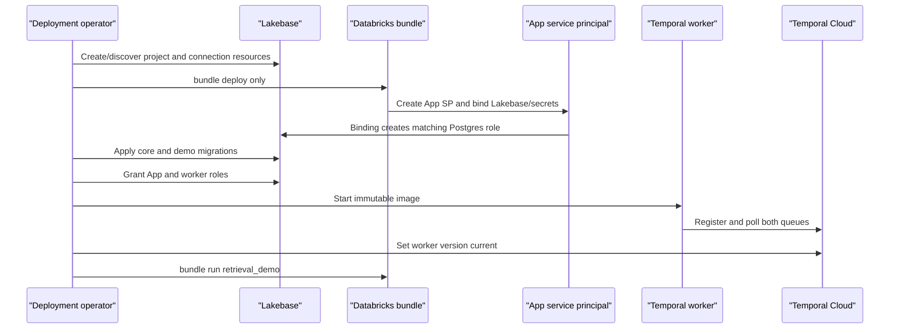

# Deploy the Lakebase + Temporal retrieval demo

This runbook deploys the implementation described in
[`docs/lakebase-temporal-demo-spec.md`](../lakebase-temporal-demo-spec.md).

The target topology is:

- a Databricks App running the FastAPI UI/API;
- a Lakebase Autoscaling project, branch, endpoint, and database;
- a Temporal Cloud namespace;
- one separately deployed, long-running `retrieval-worker` container.

The App is a command/read gateway. It must not run the Temporal workers. Both processes use
Lakebase with distinct service principals and PostgreSQL grants.

## 1. Inputs

Collect these values before changing a workspace:

| Name used below | Meaning |
| --- | --- |
| `DBX_PROFILE` | User-selected, OAuth-authenticated Databricks CLI profile |
| `BUNDLE_TARGET` | `dev` for rehearsal or `prod` for the presentation environment |
| `LB_PROJECT_ID` | Dedicated Lakebase project ID, such as `retrieval-demo` |
| `LB_BRANCH_NAME` | Full `projects/.../branches/...` resource name |
| `LB_DATABASE_NAME` | Full `projects/.../branches/.../databases/...` resource name |
| `LB_ENDPOINT_NAME` | Full `projects/.../branches/.../endpoints/...` resource name |
| `LB_ENDPOINT_HOST` | Host returned by `get-endpoint` |
| `MIGRATION_DB_USER` | Database owner, normally the project creator's email |
| `TEMPORAL_SECRET_SCOPE` | Secret scope containing Temporal connection values |
| `WORKER_CLIENT_ID` | Databricks service-principal client ID used by the worker |
| `WORKER_IMAGE` | Immutable worker image URI/tag or digest |
| `WORKER_BUILD_ID` | Immutable Temporal build ID, normally a Git SHA/image digest |

The App's bundle resource key is `retrieval_demo`. Its declared workspace name is
`lakebase-temporal-demo`, but development mode can decorate effective names; obtain the deployed
name from `bundle summary`.

The worker service principal must be added to the target Databricks workspace and have an OAuth M2M
secret available to its container runtime. The container platform is external to this repository.
It must support an always-running process, secret injection, graceful termination, and outbound
TLS.

## 2. First-deploy order



For the first deployment, do not use the combined `databricks apps deploy` command. It can start
the App before migrations and grants exist. Use `bundle deploy`, then migrate/grant, start the
worker, and finally `bundle run`.

## 3. Preflight

From the repository root:

```bash
make verify
databricks --version
temporal --version
docker version
databricks auth profiles
```

Requirements:

- Databricks CLI `>=0.299.0`;
- a Temporal CLI with `temporal worker deployment`;
- Docker or a compatible OCI builder;
- `uv` and Python 3.11+;
- a valid Databricks OAuth profile;
- `CAN MANAGE` access to the Lakebase project and App plus `MANAGE` on the secret scope;
- a Temporal Cloud namespace and API key.

If no profile is valid, stop and authenticate using a user-chosen descriptive profile. Never
silently select or create `DEFAULT`, and do not use a personal access token:

```bash
databricks auth login \
  --host <DATABRICKS_WORKSPACE_URL> \
  --profile <USER_CHOSEN_PROFILE>

databricks auth profiles
databricks current-user me --profile <USER_CHOSEN_PROFILE>
```

Set non-secret helpers:

```bash
export DBX_PROFILE=<USER_CHOSEN_PROFILE>
export BUNDLE_TARGET=dev
export LB_PROJECT_ID=retrieval-demo
export TEMPORAL_SECRET_SCOPE=retrieval-demo-temporal
```

Use `--profile "$DBX_PROFILE"` on every Databricks command.

## 4. Provision or select Lakebase

For a new dedicated project, create it directly:

```bash
databricks postgres create-project "$LB_PROJECT_ID" \
  --json '{"spec":{"display_name":"Temporal Retrieval Demo"}}' \
  --profile "$DBX_PROFILE"
```

Discover the generated branch, database, and endpoint. Copy their full `.name` values rather than
constructing resource IDs from display names:

```bash
databricks postgres list-branches "projects/$LB_PROJECT_ID" \
  --profile "$DBX_PROFILE" -o json

databricks postgres list-databases \
  "projects/$LB_PROJECT_ID/branches/production" \
  --profile "$DBX_PROFILE" -o json

databricks postgres list-endpoints \
  "projects/$LB_PROJECT_ID/branches/production" \
  --profile "$DBX_PROFILE" -o json
```

Set the discovered values:

```bash
export LB_BRANCH_NAME=projects/<PROJECT>/branches/<BRANCH>
export LB_DATABASE_NAME=projects/<PROJECT>/branches/<BRANCH>/databases/<DATABASE_RESOURCE_ID>
export LB_ENDPOINT_NAME=projects/<PROJECT>/branches/<BRANCH>/endpoints/<ENDPOINT>
export LB_DATABASE=databricks_postgres
```

Get the host from `status.hosts.host`:

```bash
databricks postgres get-endpoint "$LB_ENDPOINT_NAME" \
  --profile "$DBX_PROFILE" -o json

export LB_ENDPOINT_HOST=<STATUS_HOSTS_HOST>
```

If using a shared project, create a dedicated branch whose TTL extends beyond rehearsal and the
meeting, then rediscover its database and endpoint:

```bash
databricks postgres create-branch "projects/$LB_PROJECT_ID" retrieval-demo \
  --json '{"spec":{"source_branch":"projects/<PROJECT>/branches/<SOURCE>","ttl":"604800s"}}' \
  --profile "$DBX_PROFILE"
```

The default compute is sufficient for five documents. Inspect endpoint state and explicitly confirm
autoscaling/scale-to-zero settings. Open the App early enough to pre-warm it before presenting.

Use `postgres_text` for the required path. Core migration 2 creates the GIN index. Lakebase Search
is optional and must be enabled and rehearsed separately, never during the presentation.

## 5. Create the Temporal secret scope

The checked-in bundle expects exactly these keys:

- `temporal-address` — Temporal Cloud `host:port`;
- `temporal-namespace` — namespace name;
- `temporal-api-key` — API key.

Create the scope once, then enter values interactively so they do not appear in shell history:

```bash
databricks secrets create-scope "$TEMPORAL_SECRET_SCOPE" \
  --profile "$DBX_PROFILE"

databricks secrets put-secret "$TEMPORAL_SECRET_SCOPE" temporal-address \
  --profile "$DBX_PROFILE"

databricks secrets put-secret "$TEMPORAL_SECRET_SCOPE" temporal-namespace \
  --profile "$DBX_PROFILE"

databricks secrets put-secret "$TEMPORAL_SECRET_SCOPE" temporal-api-key \
  --profile "$DBX_PROFILE"

databricks secrets list-secrets "$TEMPORAL_SECRET_SCOPE" \
  --profile "$DBX_PROFILE"
```

The list returns metadata only. Confirm all three keys exist.

`TEMPORAL_WEB_BASE_URL` is optional and is not currently a bundle resource. Without it, the UI
shows workflow IDs but not deep links. To add links, bind a fourth secret resource to that variable
in both App manifests; do not place a bundle variable expression directly in the App config env.

## 6. Create the App resource without starting it

Run bundle commands from `apps/retrieval_demo`:

```bash
cd apps/retrieval_demo

databricks bundle validate --strict \
  --profile "$DBX_PROFILE" \
  -t "$BUNDLE_TARGET" \
  --var "lakebase_branch=$LB_BRANCH_NAME" \
  --var "lakebase_database=$LB_DATABASE_NAME" \
  --var "temporal_secret_scope=$TEMPORAL_SECRET_SCOPE"

databricks bundle deploy \
  --profile "$DBX_PROFILE" \
  -t "$BUNDLE_TARGET" \
  --var "lakebase_branch=$LB_BRANCH_NAME" \
  --var "lakebase_database=$LB_DATABASE_NAME" \
  --var "temporal_secret_scope=$TEMPORAL_SECRET_SCOPE"
```

Do not run the App yet. Obtain the effective name and App service-principal client ID:

```bash
databricks bundle summary \
  --profile "$DBX_PROFILE" \
  -t "$BUNDLE_TARGET" \
  --var "lakebase_branch=$LB_BRANCH_NAME" \
  --var "lakebase_database=$LB_DATABASE_NAME" \
  --var "temporal_secret_scope=$TEMPORAL_SECRET_SCOPE"

export DEPLOYED_APP_NAME=<NAME_FROM_BUNDLE_SUMMARY>

databricks apps get "$DEPLOYED_APP_NAME" \
  --profile "$DBX_PROFILE" -o json

export APP_DB_ROLE=<SERVICE_PRINCIPAL_CLIENT_ID>
```

The `postgres` binding creates a matching Lakebase role and grants database `CONNECT` and `CREATE`.
The repository grant command narrows object access but does not revoke database-level `CREATE`.

## 7. Create the worker's Lakebase role

Have an administrator create/select a dedicated Databricks service principal for the worker, add it
to the workspace, and issue an OAuth M2M secret. Do not reuse the App identity.

```bash
export WORKER_CLIENT_ID=<WORKER_SERVICE_PRINCIPAL_CLIENT_ID>

databricks postgres list-roles "$LB_BRANCH_NAME" \
  --profile "$DBX_PROFILE" -o json
```

If no managed role exists for this client ID, create one:

```bash
databricks postgres create-role "$LB_BRANCH_NAME" \
  --role-id retrieval-worker \
  --json "{\"spec\":{\"postgres_role\":\"$WORKER_CLIENT_ID\",\"identity_type\":\"SERVICE_PRINCIPAL\",\"auth_method\":\"LAKEBASE_OAUTH_V1\"}}" \
  --profile "$DBX_PROFILE"
```

The value later passed to `--worker-role` and `PGUSER` is `postgres_role`—the client ID—not the
`retrieval-worker` API resource slug.

## 8. Apply schemas and grants

Return to the root and install the migration runtime:

```bash
cd ../..
uv sync --frozen --extra lakebase
```

Run migrations as the project creator/database owner:

```bash
databricks current-user me --profile "$DBX_PROFILE" -o json
export MIGRATION_DB_USER=<USER_NAME_FROM_CURRENT_USER>

unset DATABRICKS_HOST
unset DATABRICKS_CLIENT_ID
unset DATABRICKS_CLIENT_SECRET
unset DATABRICKS_AUTH_TYPE
export DATABRICKS_CONFIG_PROFILE="$DBX_PROFILE"
export PGHOST="$LB_ENDPOINT_HOST"
export PGPORT=5432
export PGDATABASE="$LB_DATABASE"
export PGUSER="$MIGRATION_DB_USER"
export PGSSLMODE=require
export LAKEBASE_ENDPOINT="$LB_ENDPOINT_NAME"
export LAKEBASE_POOL_MIN_SIZE=1
export LAKEBASE_POOL_MAX_SIZE=2
unset PGPASSWORD
unset LAKEBASE_PASSWORD
```

Apply core first, demo second, grants third:

```bash
uv run retrieval-lakebase-migrate
uv run retrieval-demo-migrate
uv run retrieval-lakebase-grant-roles \
  --app-role "$APP_DB_ROLE" \
  --worker-role "$WORKER_CLIENT_ID"

uv run retrieval-lakebase-migrate --check --json
uv run retrieval-demo-migrate --check --json
```

Both checks must report `"ready": true`. Migrations are forward-only and checksum verified. Never
edit applied migration SQL; add a new numbered migration and re-run grants when new objects need
permissions.

Optional hardening: a database owner can revoke database-level `CREATE` from `APP_DB_ROLE` after
binding. Resource updates can re-grant it, so re-check after every App deployment. This is optional
for the isolated demo database.

## 9. Build and deploy the worker

Build an immutable image from the repository root:

```bash
export WORKER_BUILD_ID=<GIT_SHA_OR_IMAGE_DIGEST>
export WORKER_IMAGE=<REGISTRY>/retrieval-worker:"$WORKER_BUILD_ID"

docker build -f Dockerfile.worker -t "$WORKER_IMAGE" .
docker push "$WORKER_IMAGE"
```

Start one replica initially. The image entry point is `retrieval-worker`.

Inject these secrets through the container platform:

| Variable | Value |
| --- | --- |
| `DATABRICKS_CLIENT_ID` | Worker service-principal client ID |
| `DATABRICKS_CLIENT_SECRET` | Worker service-principal OAuth secret |
| `TEMPORAL_API_KEY` | Temporal Cloud API key |

Set this non-secret environment:

```text
DATABRICKS_HOST=<workspace-url>
DATABRICKS_AUTH_TYPE=oauth-m2m
PGHOST=<Lakebase endpoint host>
PGPORT=5432
PGDATABASE=databricks_postgres
PGUSER=<worker service-principal client ID>
PGSSLMODE=require
LAKEBASE_ENDPOINT=projects/.../branches/.../endpoints/...
LAKEBASE_POOL_MIN_SIZE=1
LAKEBASE_POOL_MAX_SIZE=20
LAKEBASE_APPLICATION_NAME=retrieval-demo-worker

TEMPORAL_ADDRESS=<Temporal Cloud host:port>
TEMPORAL_NAMESPACE=<namespace>
TEMPORAL_TLS=true
TEMPORAL_RETRIEVAL_TASK_QUEUE=retrieval-v2
TEMPORAL_PROVIDER_TASK_QUEUE=retrieval-provider-v2
TEMPORAL_DEPLOYMENT_NAME=retrieval-v2
TEMPORAL_BUILD_ID=<immutable build ID>
TEMPORAL_USE_WORKER_VERSIONING=true
TEMPORAL_ENABLE_SEARCH_ATTRIBUTES=false
TEMPORAL_SERVER_PRIORITY_FAIRNESS_SUPPORTED=false

RETRIEVAL_DEMO_MODE=true
RETRIEVAL_ADAPTER_BUNDLE_FACTORY=retrieval.demo.scripted_provider:create_adapter_bundle
OBJECT_CLEANUP_BATCH_SIZE=250
```

Do not also set the individual adapter factories or
`RETRIEVAL_ALLOW_UNSAFE_IN_MEMORY_ADAPTERS`; the worker rejects mixed modes.

The worker entry point can also read a mounted environment file selected with
`RETRIEVAL_ENV_FILE=/run/secrets/retrieval-worker.env`. Use that only when the container platform's
native per-variable injection is unavailable: mount the file read-only, restrict it to the worker
UID (mode `0600`), and do not bake it into the image. Existing platform variables take precedence
over file values, interpolation is disabled, and a missing explicit file fails startup. The image
build context excludes `.env` and `*.env` files.

Allow outbound TLS to Temporal Cloud, the Databricks workspace/control plane, and the Lakebase
endpoint on port 5432. Send `SIGTERM` and allow at least 45 seconds for shutdown. The worker exposes
no HTTP port and writes logs to stdout/stderr.

After start, verify recent pollers on both task queues using a Temporal CLI profile or secret-aware
shell:

```bash
temporal task-queue describe \
  --address <TEMPORAL_ADDRESS> \
  --namespace <TEMPORAL_NAMESPACE> \
  --tls \
  --task-queue retrieval-v2 \
  --select-all-active

temporal task-queue describe \
  --address <TEMPORAL_ADDRESS> \
  --namespace <TEMPORAL_NAMESPACE> \
  --tls \
  --task-queue retrieval-provider-v2 \
  --task-queue-type activity \
  --select-all-active
```

Do not paste the Temporal API key into shell history. Once both queues have pollers, make the worker
version current:

```bash
temporal worker deployment set-current-version \
  --address <TEMPORAL_ADDRESS> \
  --namespace <TEMPORAL_NAMESPACE> \
  --tls \
  --deployment-name retrieval-v2 \
  --build-id "$WORKER_BUILD_ID"
```

Do not use `--ignore-missing-task-queues`.

## 10. Start the App

From `apps/retrieval_demo`, apply config and start the process:

```bash
cd apps/retrieval_demo

databricks bundle run retrieval_demo \
  --profile "$DBX_PROFILE" \
  -t "$BUNDLE_TARGET" \
  --var "lakebase_branch=$LB_BRANCH_NAME" \
  --var "lakebase_database=$LB_DATABASE_NAME" \
  --var "temporal_secret_scope=$TEMPORAL_SECRET_SCOPE"
```

`bundle deploy` alone is not sufficient. Inspect status, URL, permissions, and logs:

```bash
databricks bundle summary \
  --profile "$DBX_PROFILE" \
  -t "$BUNDLE_TARGET" \
  --var "lakebase_branch=$LB_BRANCH_NAME" \
  --var "lakebase_database=$LB_DATABASE_NAME" \
  --var "temporal_secret_scope=$TEMPORAL_SECRET_SCOPE"

databricks apps get "$DEPLOYED_APP_NAME" --profile "$DBX_PROFILE" -o json
databricks apps get-permissions "$DEPLOYED_APP_NAME" --profile "$DBX_PROFILE"
databricks apps logs "$DEPLOYED_APP_NAME" \
  --profile "$DBX_PROFILE" --tail-lines 200
```

The App resource injects `PGHOST`, `PGPORT`, `PGDATABASE`, `PGUSER`, `PGSSLMODE`, the endpoint,
and App service-principal credentials. Open the App URL and confirm:

- `/healthz` returns 200;
- `/readyz` returns 200 with database, migrations, and Temporal ready;
- the search badge says `postgres_text`;
- logs contain no permission, migration, Temporal TLS, or token errors.

The App binds one Uvicorn process to `0.0.0.0:$DATABRICKS_APP_PORT`. Workflow commands return
asynchronously; the browser polls instead of holding a request open.

## 11. Rehearse

1. Create a fresh Northstar run; confirm `active`, generation 7, zero documents.
2. Start sync; confirm one quota wait and automatic resume.
3. Wait for four committed documents and the held `late-security-review.md`.
4. Ask the fixed account-priority question and verify four cited sources.
5. Start deactivation and confirm Lakebase commits `7 -> 8`, `deactivating`.
6. Release the late write only after the UI enables the control.
7. Confirm `stale_generation_rejected` shows expected 7, actual 8.
8. Confirm final `inactive`, generation 8, zero documents, and zero chunks.

Use a new run for every rehearsal and another new run for the live presentation. Never rewind a
store generation.

## 12. Subsequent deployments

After bootstrap:

1. Run `make verify` and build the immutable worker image.
2. Create a short-lived pre-change Lakebase branch for risky migrations.
3. Apply core migrations, demo migrations, then grants.
4. Start the new worker image alongside the previous version.
5. Confirm both queues are polled and set/ramp the new version.
6. From `apps/retrieval_demo`, run `databricks apps deploy` with all bundle variables, or run
   `bundle deploy` followed by `bundle run`.
7. Re-check App resources, permissions, readiness, and optional `CREATE` revocation.
8. Keep the prior worker until Temporal reports its version drained.

App resource updates are replacements, not merges. Inspect resources after every deployment so a
future update does not remove secret bindings or authorization scopes.

## 13. Rollback

### App

Deploy the previous known-good repository revision, then run `retrieval_demo` again.

### Worker

Start the previous image if necessary, confirm pollers, and set its build ID current again. Do not
terminate old workers until their deployment versions are drained.

### Database

There are no down migrations. Bind both App and worker to a pre-change Lakebase branch if a forward
migration must be abandoned. Never alter an applied checksum, reset a branch, or delete resources
without explicit approval and a confirmed recovery target.

## 14. Troubleshooting

| Symptom | Check |
| --- | --- |
| Databricks profile shows `NO` | Re-run OAuth login with an explicit descriptive profile |
| Bundle resource validation fails | Use CLI `>=0.299.0` and full branch/database resource names |
| App starts before schemas exist | Stop it, migrate/grant, then `bundle run` |
| App gets `permission denied` | Confirm App role equals `service_principal_client_id`; re-run grants |
| Worker cannot generate credentials | Check M2M env, workspace membership, endpoint path, managed role |
| Worker reports missing adapters | Enable demo mode and set only the adapter-bundle factory |
| `/readyz` says migrations false | Run both migration checks as the migration owner |
| `/readyz` says Temporal false | Check address, namespace, TLS, secrets, egress, and API key |
| Command is accepted but idle | Check both queue pollers and the current worker version |
| App returns 502 | Confirm `DATABRICKS_APP_PORT` and host `0.0.0.0` |
| App update is absent | Run `bundle run retrieval_demo` after `bundle deploy` |
| First request after idle fails | Pre-warm and verify pool retry/pre-ping behavior |
| Workflow links are absent | Configure optional `TEMPORAL_WEB_BASE_URL` |

## 15. Completion gate

- [ ] Databricks OAuth profile is valid and explicitly selected.
- [ ] Lakebase branch, database, endpoint, and host are recorded.
- [ ] Temporal secret scope contains all three keys.
- [ ] App resource exists with Lakebase and secret bindings.
- [ ] App and worker use distinct identities.
- [ ] Both migration checks report ready.
- [ ] Grants target the exact App and worker PostgreSQL roles.
- [ ] Worker runs an immutable image/build ID.
- [ ] Both Temporal queues show recent pollers.
- [ ] That worker deployment version is current.
- [ ] App `/readyz` reports database, migrations, and Temporal ready.
- [ ] The complete late-writer rehearsal passes.
- [ ] A separate fresh run is reserved for the presentation.

## References

- [Databricks App resources](https://docs.databricks.com/aws/en/dev-tools/databricks-apps/resources)
- [Use Lakebase with Databricks Apps](https://docs.databricks.com/aws/en/oltp/projects/databricks-apps)
- [Databricks bundle resources](https://docs.databricks.com/aws/en/dev-tools/bundles/resources)
- [Lakebase projects](https://docs.databricks.com/aws/en/oltp/projects/)
- [Lakebase authentication](https://docs.databricks.com/aws/en/oltp/projects/authentication)
- [Temporal Worker Versioning](https://docs.temporal.io/production-deployment/worker-deployments/worker-versioning)
