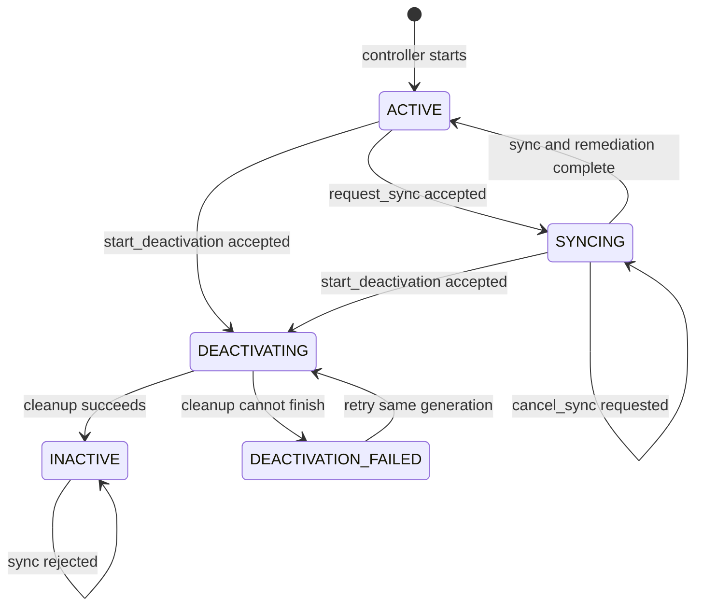
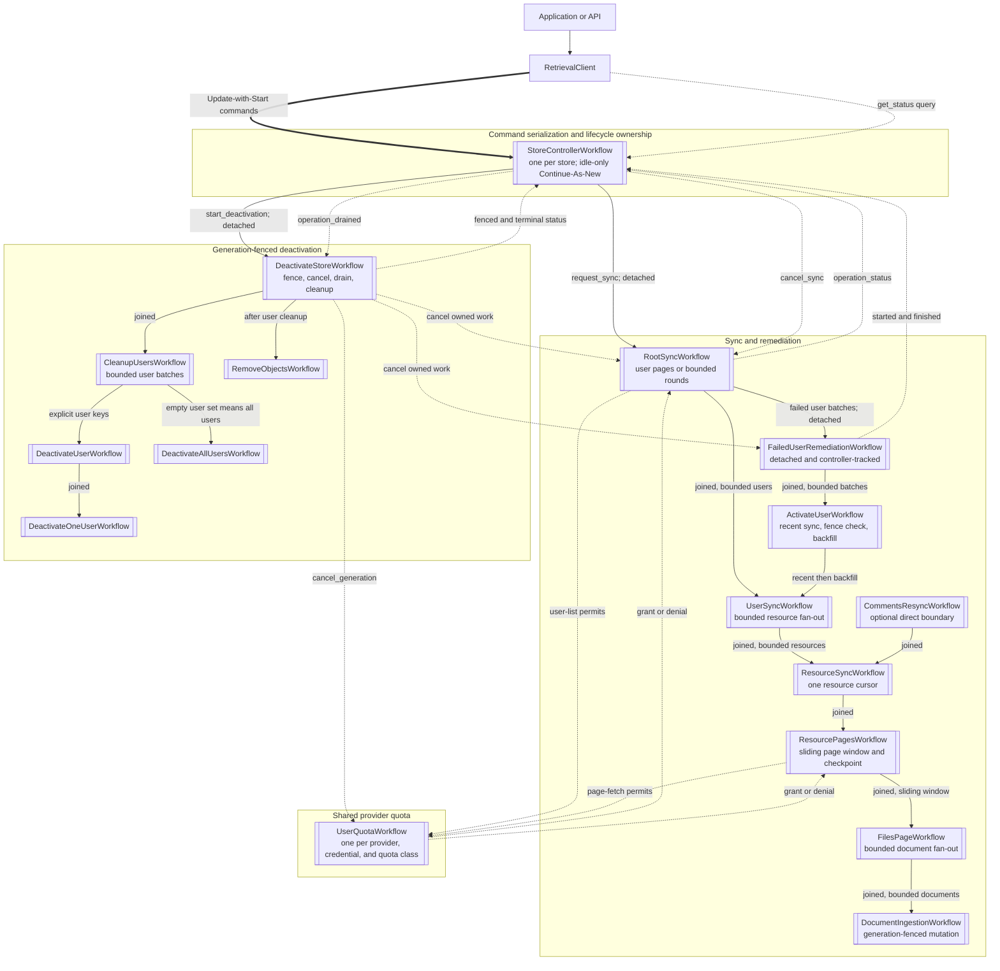
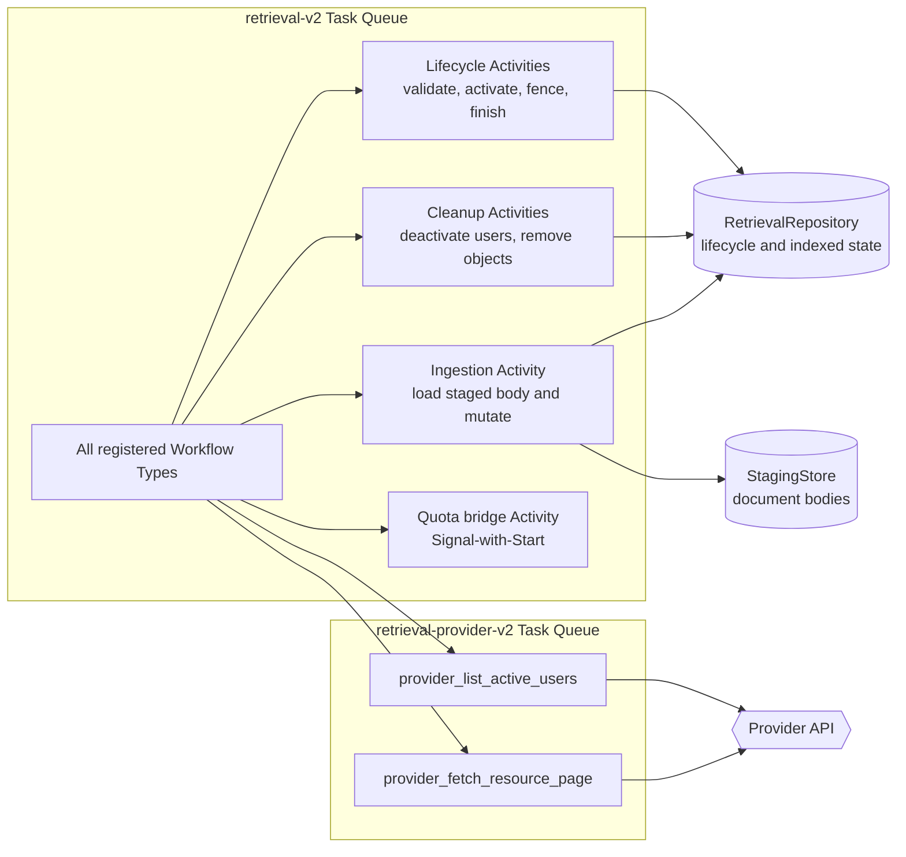
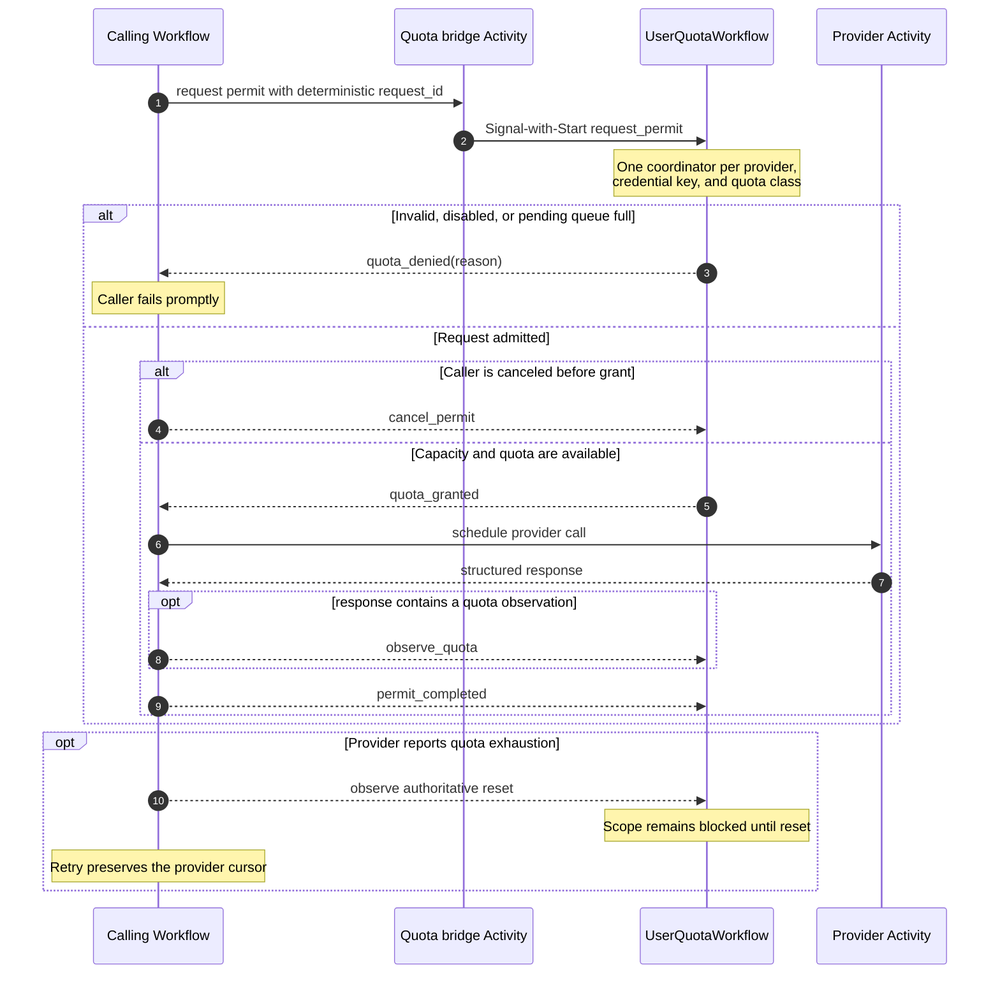
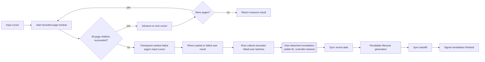
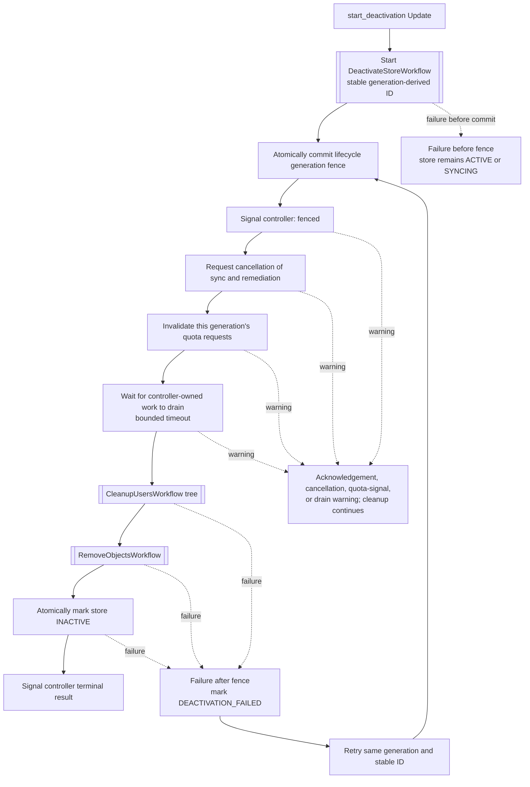

# Workflow topology

This page is the visual guide to the runtime described in
[`IMPLEMENTATION_MAP.md`](../IMPLEMENTATION_MAP.md). It shows workflow ownership, bounded fan-out,
provider quota coordination, recovery, and store deactivation.

In the diagrams, a **joined** child must finish before its parent can finish. A **detached**
workflow is started with a stable Workflow ID, acknowledged by Temporal, and then tracked by the
store controller. Dashed arrows represent Signals, cancellation requests, or shared coordination
rather than parent-child ownership.

## Store lifecycle and command flow

Applications do not start sync or deactivation workflows directly. They call `RetrievalClient`,
which uses Update-with-Start to create or update the single controller for a store.

The controller accepts only one store operation at a time. A store remains `SYNCING` while any
detached failed-user remediation is still active, even if its root sync has already finished.

## End-to-end workflow tree

`CommentsResyncWorkflow` is registered for callers that use the direct comments boundary; the
controller-driven sync tree does not start it. `QuotaWaitWorkflow` and `AccessioningWorkflow` can
be registered only for draining compatible existing histories and are never started by the
current execution path. See the deployment runbook before enabling those registrations.

## Activity and Task Queue boundaries

The `retrieval-worker` process starts two Temporal workers. The queue split isolates provider API
traffic from repository and staging work, and lets operators apply a provider Activity rate limit
without throttling lifecycle operations.

The queue names shown are defaults. `TEMPORAL_RETRIEVAL_TASK_QUEUE` and
`TEMPORAL_PROVIDER_TASK_QUEUE` override them.

## Shared quota permit loop

`RootSyncWorkflow` and `ResourcePagesWorkflow` acquire a permit before scheduling a provider
Activity when their input includes a quota scope. Waiting is durable and does not occupy an
Activity worker slot.

The pending queue is capped at 350 requests per quota scope. `permit_completed` releases the
in-flight concurrency reservation; it does not refund provider quota. Only an authoritative quota
observation or reset restores quota capacity.

## Page failure, checkpoint, and remediation

Resource pages execute in a sliding window. Successful work after an earlier failure may run
again, so document writes and deletes must be idempotent.

Root progress passed through Continue-As-New is cumulative, while error samples, failed-user
samples, and remediation IDs remain bounded. A new store sync is rejected until remediation has
finished.

## Deactivation order and recovery

The generation fence is the point of no return. It is committed before cancellation, making late
Activity delivery safe: every persistent mutation compares the expected generation and allowed
lifecycle state in the same transaction as its write.

Warnings do not interrupt cleanup, but they can produce a `PARTIAL` result. A committed generation
is never decremented during a retry, deployment rollback, or operational recovery.

## Ownership and concurrency summary

| Boundary | Completion rule | Bound or barrier |
|---|---|---|
| Controller → root sync | Detached, stable ID, controller registry | One active sync per store |
| Root sync → user sync | Joined children | User-page barrier or bounded round window |
| User sync → resource sync | Joined children | `RESOURCE_CONCURRENCY` |
| Resource pages → files page | Joined sliding window | `FILES_PAGE_WINDOW_SIZE` |
| Files page → document ingestion | Joined children | Lower of the two configured per-page document bounds |
| Root sync → remediation | Detached, stable ID, controller registry | Bounded activation batches and Continue-As-New |
| Remediation → activation | Joined children | Bounded batch |
| Activation → user sync | Sequential recent and backfill waves | Generation check between waves |
| Provider request → quota | Shared Signal-with-Start coordinator | Per-scope in-flight and pending caps |
| Controller → deactivation | Detached, stable generation ID | Fence before cancellation and bounded drain |
| Deactivation → cleanup | Joined children | Bounded user batches, then object cleanup |
