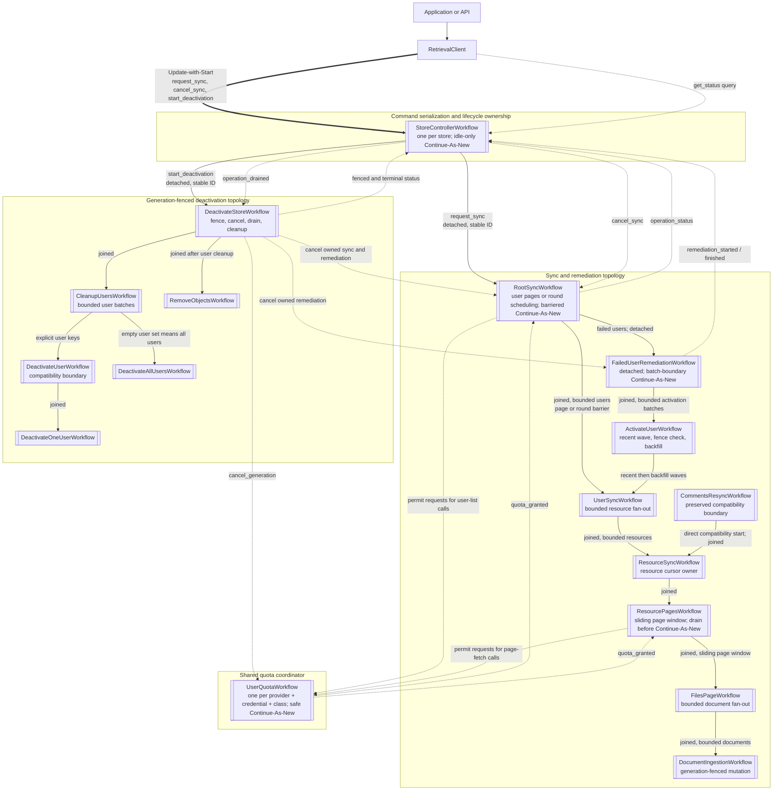
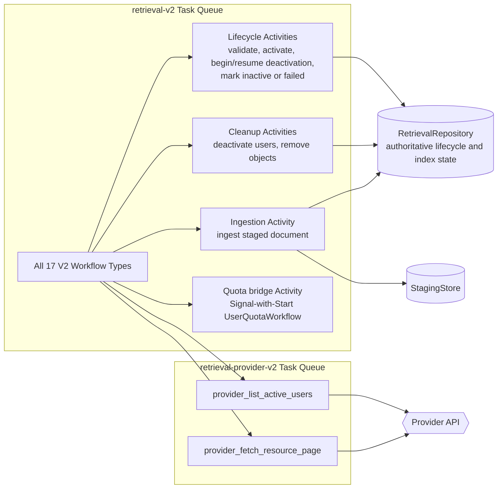
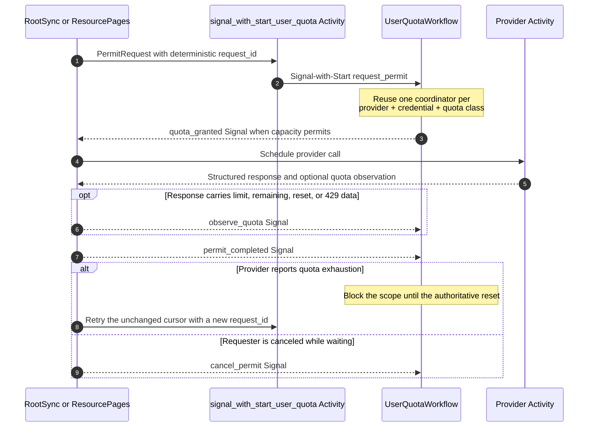
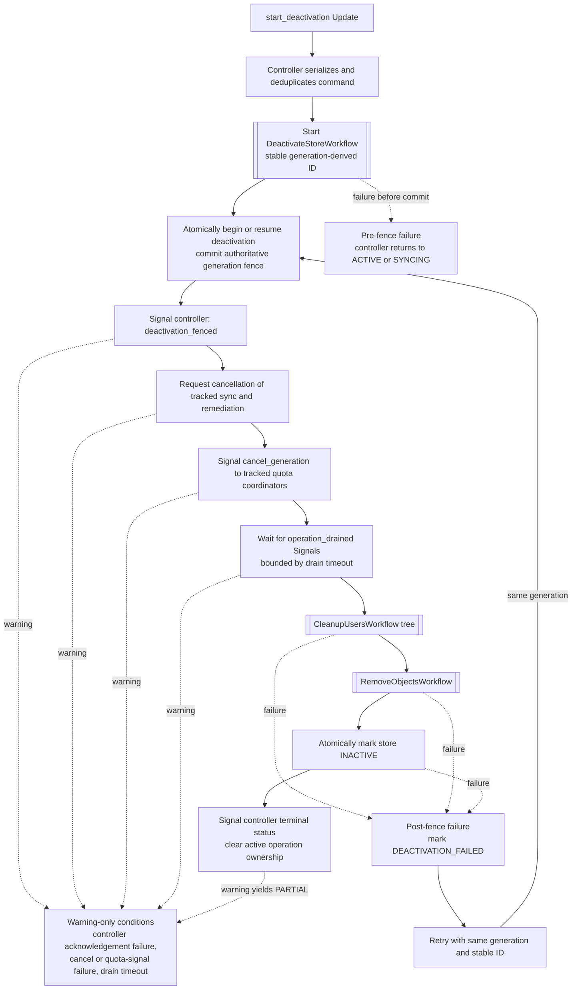

# Workflow topology

This page is the visual companion to [`IMPLEMENTATION_MAP.md`](../IMPLEMENTATION_MAP.md). It
shows the V2 execution paths registered by `worker.py`, including the detached ownership,
bounded fan-out, shared quota, and generation-fenced deactivation boundaries. The architecture is
split into focused views so that the complete topology remains readable.

## End-to-end workflow tree

Solid arrows are child-workflow starts. Dashed arrows are Signals, cancellation, or shared
coordination rather than parent-child ownership. `joined` means the parent awaits completion;
`detached` means the start is durably acknowledged and the stable Workflow ID is tracked by the
store controller.

`CommentsResyncWorkflow` remains registered as a direct compatibility boundary but is not started
by the controller-driven V2 path. `QuotaWaitWorkflow` and `AccessioningWorkflow` are optional
legacy-drain registrations and are never started by a new V2 execution.

## Activity and Task Queue boundaries

Both workers run in the `retrieval-worker` process. Workflow Tasks and persistence-facing
Activities use `retrieval-v2`; provider calls use the separate, optionally rate-limited
`retrieval-provider-v2` queue. These are the default queue names and can be overridden through
runtime configuration.

## Shared quota permit loop

Only `RootSyncWorkflow` and `ResourcePagesWorkflow` make provider calls. When a quota scope is
present, they acquire a permit before scheduling the provider Activity; waiting is durable and
does not occupy a worker slot.

The permit cost is not refunded after provider work begins. `permit_completed` only releases the
in-flight concurrency reservation; an authoritative observation or reset restores quota.

## Deactivation order and failure boundary

The generation fence is the point of no return. Cancellation never precedes it, so late Activity
delivery remains harmless: every mutation compares the expected lifecycle generation in the same
transaction as the write.

Warning-only conditions do not interrupt the solid-arrow cleanup path. They can produce a
`PARTIAL` terminal result after cleanup still succeeds. A committed generation is never
decremented during retry or rollback.

## Ownership and concurrency summary

| Boundary | Ownership and completion rule | Bound or barrier |
|---|---|---|
| Controller → root sync | Detached start, stable ID, controller registry | One active sync per store |
| Root sync → user sync | Joined children | User-page barrier or bounded round window |
| User sync → resource sync | Joined children | `RESOURCE_CONCURRENCY` |
| Resource pages → files page | Joined sliding window | `FILES_PAGE_WINDOW_SIZE` |
| Files page → document ingestion | Joined children | Per-page and global document bounds |
| Root sync → remediation | Detached start, stable ID, controller registry | Bounded activation batches; safe Continue-As-New |
| Remediation → activation | Joined children | At most eight or configured resource bound |
| Activation → user sync | Sequential recent and backfill waves | Generation revalidated between waves |
| Provider request → quota | Shared Signal-with-Start coordinator | Per-scope in-flight cap and reset state |
| Controller → deactivation | Detached start, stable generation ID | Fence before cancellation; bounded drain |
| Deactivation → cleanup | Joined children | Bounded user batches, then object cleanup |
