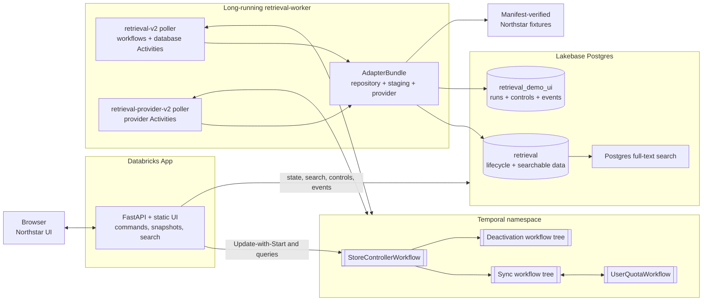
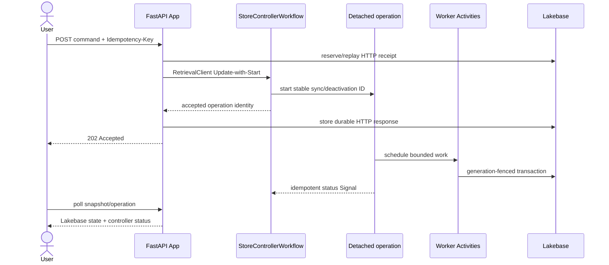
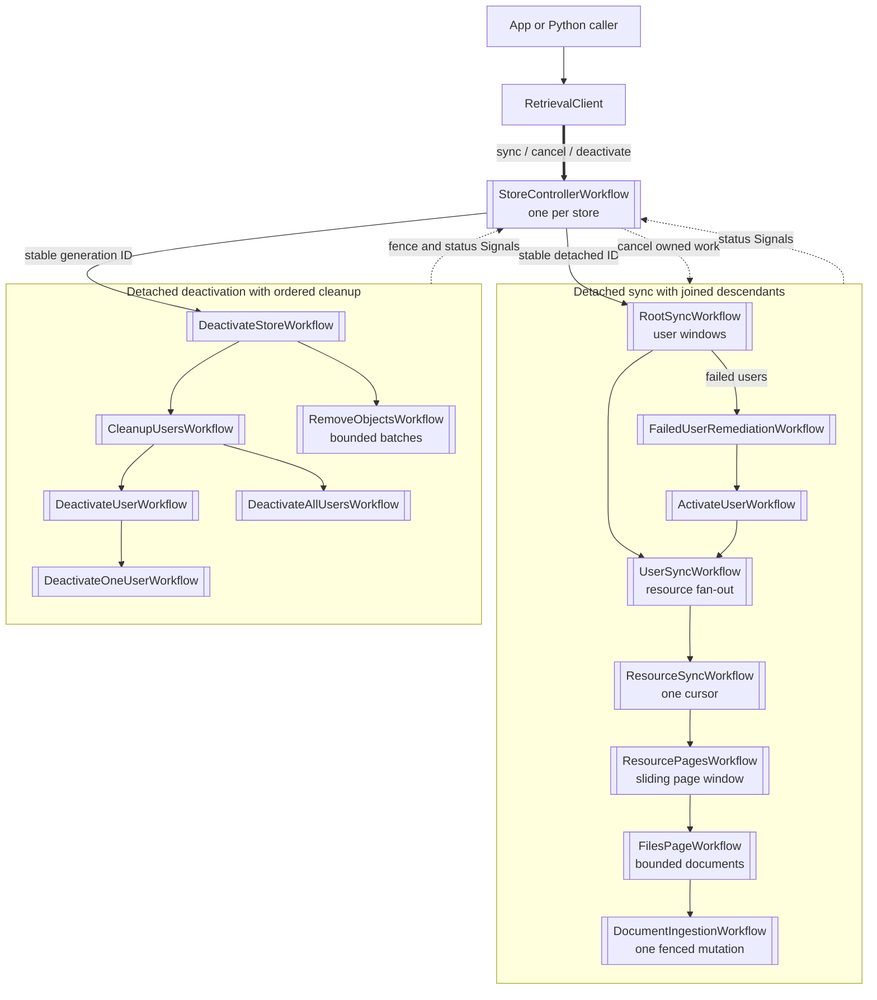
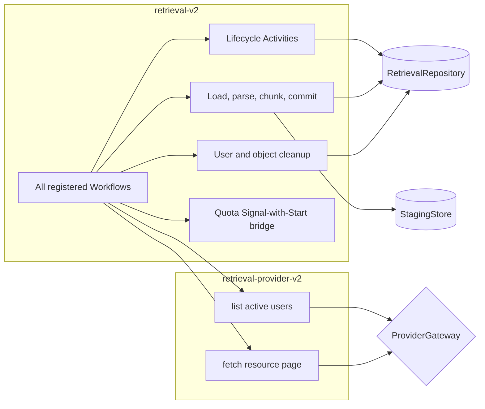
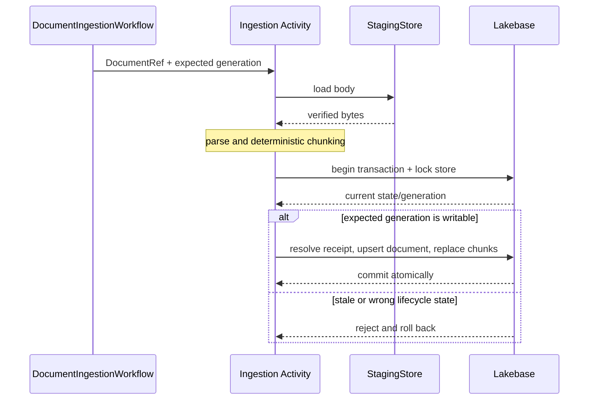
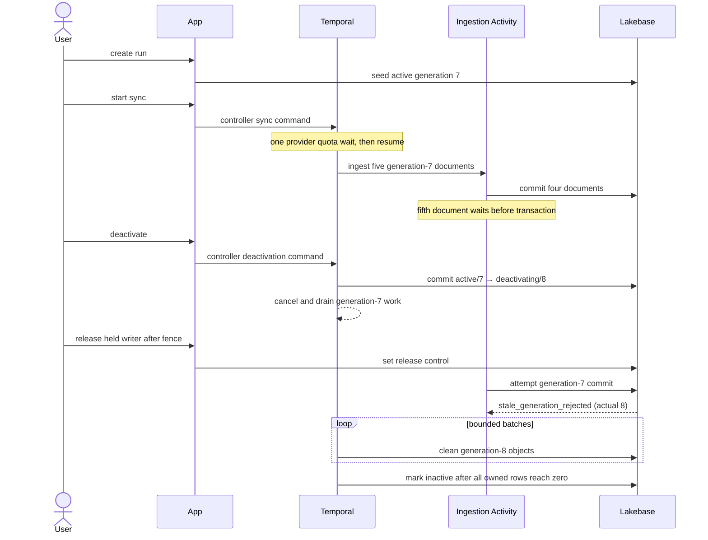
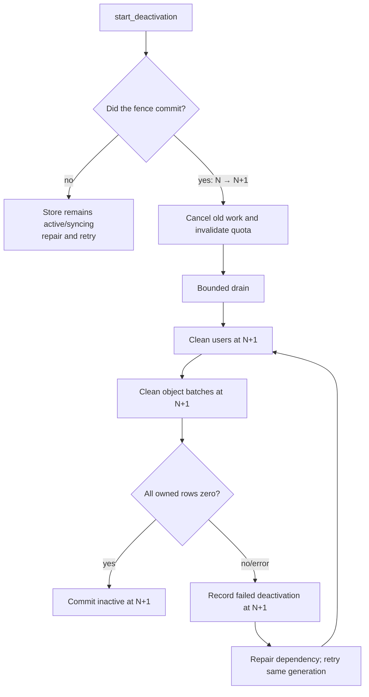

# Workflow and data topology

This page visualizes how requests move through the system. It assumes only the component overview
in the root [README](../README.md).

Temporal vocabulary used in the diagrams:

- a **Workflow** is deterministic code whose progress is stored in Event History;
- an **Activity** performs external I/O and may be retried;
- a **Task Queue** connects Temporal tasks to worker pollers;
- a **joined child** must finish before its parent finishes;
- a **detached operation** has a stable Workflow ID, is owned by the store controller, and may
  outlive the controller run that started it.

## Runtime processes and ownership



The App serves HTTP but never polls Temporal. The worker polls Temporal but never serves HTTP.
Both use Lakebase with different database roles. A third migration identity owns the schemas.

## From an HTTP command to durable work



The browser does not hold an HTTP request open while a workflow runs. HTTP idempotency is stored in
Lakebase, while workflow command deduplication belongs to the controller.

## Store controller and child workflows



The controller serializes lifecycle decisions but does not absorb high-volume fan-out into its own
history. Page windows, document windows, and cleanup batches are finite. Continue-As-New is used
where long-lived state needs a fresh Event History.

## Task Queue boundaries



The split allows provider calls to have their own pollers and rate limit without throttling
lifecycle or database work. Document bodies are loaded only inside the ingestion Activity.

## Shared provider quota

One quota workflow coordinates callers that share a provider credential scope.

```mermaid
sequenceDiagram
    participant W as Sync workflow
    participant B as Bridge Activity
    participant Q as UserQuotaWorkflow
    participant P as Provider Activity

    W->>B: deterministic permit request
    B->>Q: Signal-with-Start
    alt queue full or invalid
        Q-->>W: explicit denial
    else permit granted
        Q-->>W: quota_granted
        W->>P: provider call
        alt success
            P-->>W: page metadata / DocumentRefs
            W-->>Q: permit_completed
        else quota exhausted
            P-->>W: limit + retry/reset data
            W-->>Q: authoritative reset observation
            Note over W,Q: durable wait; cursor retained
            Q-->>W: grant after reset
            W->>P: retry
        end
    end
```

Waiting occurs in Workflow state, not an Activity process. The scope retains bounded pending,
in-flight, reset, and deduplication state.

## Document transaction



The body and chunks never become workflow payloads. A retry is safe because the receipt and
mutation share the same generation-aware transaction.

## Northstar late-writer proof



The bounded hold is demonstration code. It lets cancellation arrive and then deliberately reaches
the ordinary repository transaction so the database fence is observable.

## Deactivation recovery



Never decrement a committed generation. After the fence, recovery resumes cleanup at the same new
generation and stable deactivation identity.

## Data visibility rules

| Operation | Allowed state | Generation rule | Atomic effect |
|---|---|---|---|
| Document upsert/delete | `active` or `syncing` | expected equals current | document, chunks, receipt |
| User/checkpoint mutation | `active` or `syncing` | expected equals current | compare and mutation |
| Begin deactivation | active/syncing or resumable failure | advance once | state and generation fence |
| Cleanup | `deactivating` | cleanup generation equals current | bounded deletion |
| Mark inactive | `deactivating` | expected equals current | only after zero-row invariant |
| Search | `active` or `syncing` | data generation equals store | stale/non-readable rows excluded |

These rules make at-least-once Activity execution safe; they do not claim exactly-once execution.
