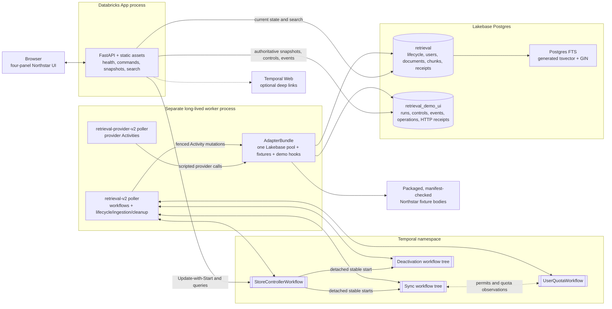
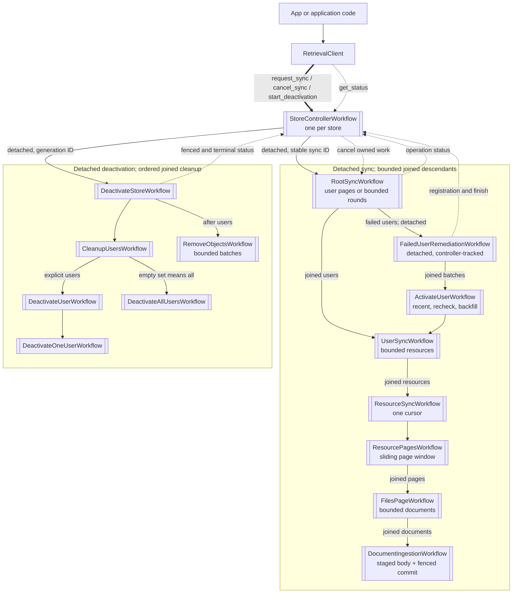
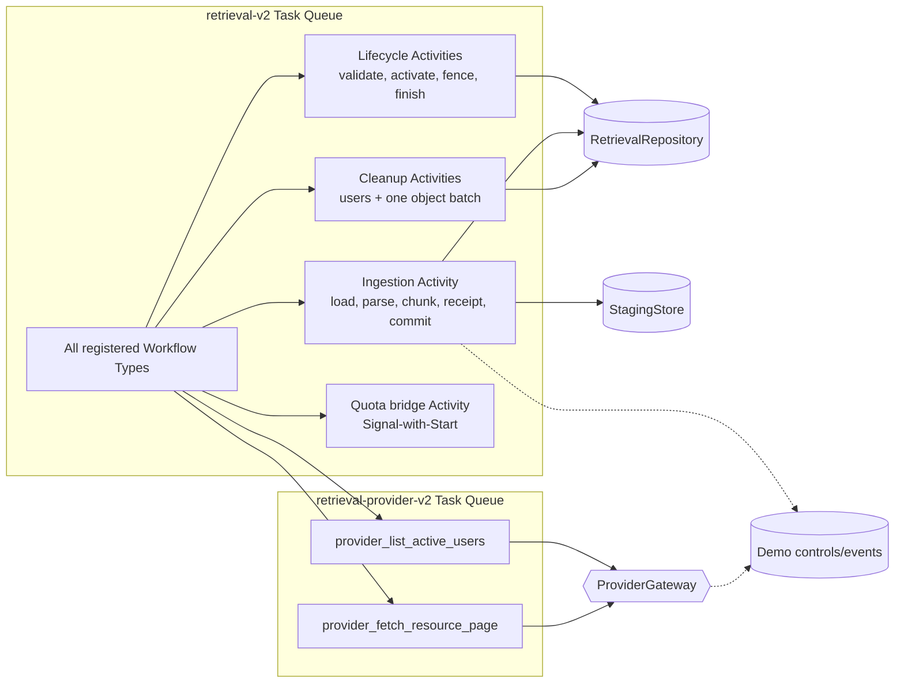
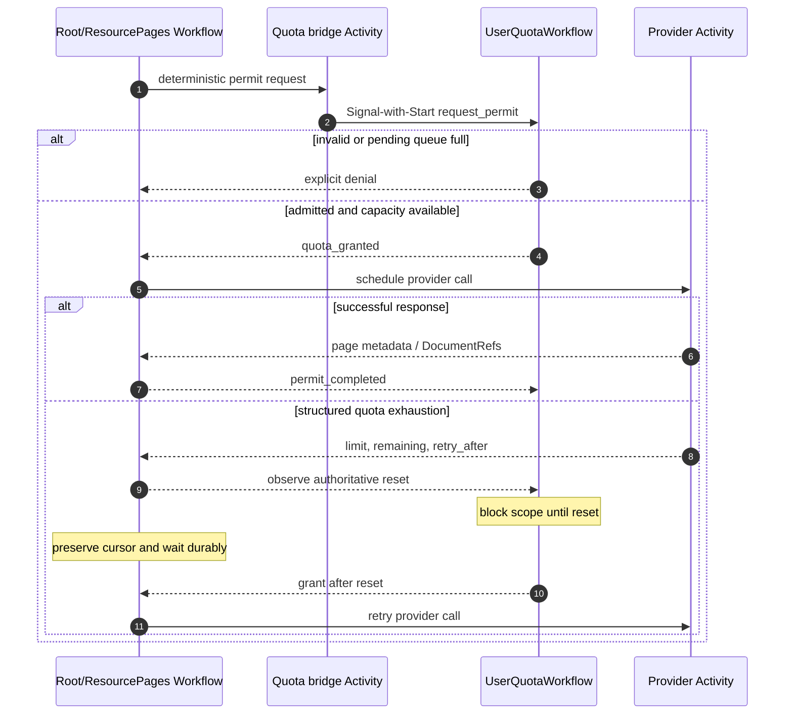
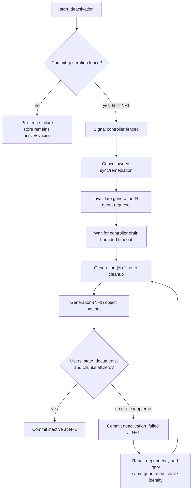

# Workflow and data topology

This is the visual map of the running system. Temporal owns durable coordination; Lakebase owns
current database truth; the FastAPI App is a control and presentation surface. A **joined** child
must finish before its parent finishes. A **detached** workflow is started with a stable ID,
acknowledged by Temporal, and tracked by the store controller.

## Runtime components and ownership



The App does not run workflows or Activities. The worker does not serve HTTP. Both use the same
database schemas with different steady-state grants. The migration identity owns both schemas and
the fixed Northstar seed function.

## Store command and workflow hierarchy

Applications never start sync or deactivation children directly. `RetrievalClient` uses
Update-with-Start to reach the single controller for the store.



`CommentsResyncWorkflow` is a registered direct resource boundary but is not started by the
controller-driven tree. Optional drain-only names are documented in
[`IMPLEMENTATION_MAP.md`](../IMPLEMENTATION_MAP.md#workflow-inventory).

## Task Queue and Activity boundaries



The queue split lets operators rate-limit provider Activities without throttling lifecycle or
database work. Queue names are configurable. Document bodies are loaded only inside the ingestion
Activity; workflow messages retain compact `DocumentRef` values.

## Shared provider quota loop

One `UserQuotaWorkflow` is keyed by provider, opaque credential key, and quota class. Waiting is
durable and consumes no Activity slot.



The pending queue is capped at 350 per scope. Completion releases the in-flight reservation; it
does not invent or refund provider quota.

## Northstar quota, held writer, fence, and cleanup

The Northstar scenario makes the correctness boundary visible. The database row, not Activity
cancellation, decides whether the late generation-7 write may commit.

```mermaid
sequenceDiagram
    autonumber
    actor U as Presenter
    participant A as FastAPI App
    participant T as Temporal workflows
    participant Q as UserQuotaWorkflow
    participant P as Scripted provider Activity
    participant I as Ingestion Activities
    participant D as Lakebase

    U->>A: Create fresh Northstar run
    A->>D: fixed seed function creates active generation 7
    U->>A: Sync account
    A->>T: request_sync Update-with-Start
    T->>Q: request permit
    Q-->>T: grant
    T->>P: list_active_users
    P->>D: atomically consume quota-once control
    P-->>T: quota exhausted, retry after 5 seconds
    T->>Q: record reset observation
    Note over T,Q: durable wait; no Activity slot held
    Q-->>T: grant after reset
    T->>P: retry and fetch five DocumentRefs

    par Four normal documents
        T->>I: ingest generation 7
        I->>D: lock store, verify 7/active, write document + chunks + receipt
        D-->>I: committed
    and Late security review
        T->>I: ingest generation 7
        I->>I: load, validate, parse, chunk
        I->>D: append document_commit_held event
        Note over I: bounded demo gate waits before transaction
    end

    U->>A: Ask account question
    A->>D: current-generation Postgres FTS
    D-->>A: cited committed evidence
    U->>A: Deactivate workspace
    A->>T: start_deactivation Update
    T->>D: begin_deactivation(expected 7)
    D-->>T: atomic active/7 -> deactivating/8
    T-->>T: cancel sync, invalidate quota, drain
    Note over I: demo-only gate survives cancellation long enough to prove the fence
    U->>A: Release late write after fence
    A->>D: set release_requested
    I->>D: attempt generation-7 commit
    D-->>I: stale_generation_rejected (actual 8)
    T->>D: deactivate users at generation 8
    loop batches of OBJECT_CLEANUP_BATCH_SIZE
        T->>D: delete one bounded object batch at generation 8
        D-->>T: documents/chunks deleted, remaining flag
    end
    T->>D: mark inactive only when all owned rows are zero
    D-->>A: inactive / generation 8 / 0 documents / 0 chunks
```

The hold hook is demo-only, heartbeat-aware, and capped at 30 seconds. It clears cancellation only
inside this bounded external-wait simulation, then performs the normal repository call. Production
Activity cancellation policy is unchanged.

## Deactivation state and recovery



Warnings from acknowledgement, cancellation, quota signaling, or drain timeout do not undo the
fence; cleanup continues and may return a partial result. A committed generation is never
decremented. The pre-batch `RemoveObjectsWorkflow` history is checked in and replayed through the
versioned compatibility branch; new executions use bounded Activities and Continue-As-New when
Temporal suggests it.

## Data visibility and transaction rules

| Operation | Required store state | Generation rule | Atomic effect |
|---|---|---|---|
| Document upsert/delete | `active` or `syncing` | expected equals current | document, chunks, and receipt commit together |
| User/retrieval-state mutation | `active` or `syncing` | expected equals current | compare and mutation share a transaction |
| Begin deactivation | active/syncing or resumable failed | expected current or idempotent replay | generation advances once and state becomes `deactivating` |
| User/object cleanup | `deactivating` | cleanup generation equals current | bounded deletion only |
| Mark inactive | `deactivating` | expected equals current | succeeds only after owned rows reach zero |
| Search | `active` or `syncing` | chunk/document generation equals store current | stale and deactivating content is invisible |

While the original generation remains current and writable, the same idempotency key plus the same
canonical payload returns the stored result. Reusing the key for a different payload is a conflict.
After a generation fence, the stale-generation decision takes precedence even when a historical
receipt exists. These rules make Temporal's at-least-once Activity execution safe; they do not
claim exactly-once execution.
